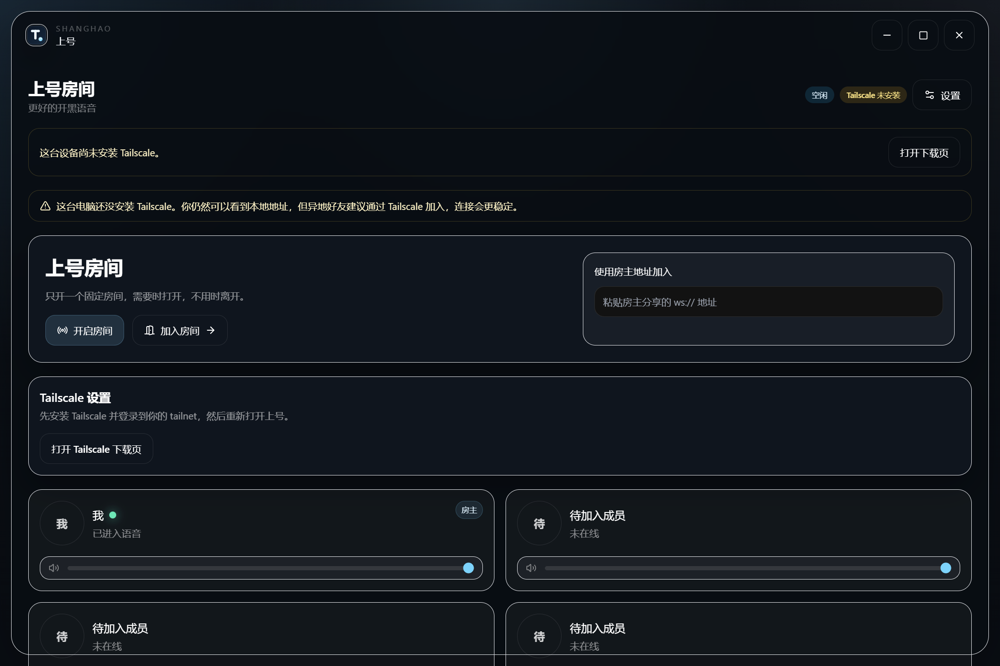

# 上号 ShangHao


给 3–5 个固定好友使用的极简桌面语音工具。朋友说一句“上号”，打开软件、加入房间、开始语音。



## 推荐连接方式

1. **临时公网（推荐）**：自动创建 Cloudflare Tunnel 临时公网地址，不要求公网 IP、端口映射或好友安装额外软件。房主关闭房间后地址失效。
2. **云中继**：在自己的公网服务器运行上号 relay，适合长期稳定使用。
3. **Tailscale**：双方安装并登录同一个 tailnet，软件优先分享稳定的 `100.x` 地址。
4. **房主直连（高级）**：只适合有公网 IP、端口映射和防火墙配置能力的用户。

房主直连只有在公网地址验证成功后才允许复制。局域网地址和未验证地址不会再伪装成跨网络可分享地址。

## 下载

在 [GitHub Releases](https://github.com/soberbw-hash/shanghao/releases) 下载：

- Windows：`ShangHao-版本-Setup-x64.exe`
- Apple Silicon Mac：`ShangHao-版本-mac-arm64.dmg`
- Intel Mac：`ShangHao-版本-mac-x64.dmg`

macOS 测试包当前未签名，首次打开可能被 Gatekeeper 拦截。测试用户可在 Finder 中右键应用并选择“打开”。正式公开发布需要 Apple Developer ID 签名和 notarization。

## 临时公网模式

选择“临时公网”，点击“开启房间”。首次使用会自动下载 `cloudflared`，随后生成真实的 `wss://xxxx.trycloudflare.com` 房间地址。好友粘贴该地址即可加入。

部分代理、TUN 或网络环境可能阻断 `trycloudflare.com`。遇到此情况请改用自部署云中继。

## 自部署云中继

详细步骤见 [自部署上号云中继](./docs/deploy-relay-server.md)。

最简启动：

```bash
corepack enable
corepack pnpm install --frozen-lockfile
corepack pnpm relay:start
```

访问 `http://服务器公网IP:43821/health`，确认返回 `ok: true`，然后在客户端设置中填写 `ws://服务器公网IP:43821`。

## 本地开发与打包

```bash
corepack pnpm install
corepack pnpm dev
corepack pnpm typecheck
corepack pnpm --dir apps/desktop test:smoke
corepack pnpm dist:win
corepack pnpm dist:mac
```

构建产物输出到 `apps/desktop/release`。推送 `v*` 标签后，[Release workflow](./.github/workflows/release.yml) 会分别在 Windows 和 macOS runner 上构建安装包。

## 连接诊断

加入失败时，在设置页导出诊断包。诊断包包括：

- 应用、协议和构建版本
- 当前连接模式、最终邀请地址、本地信令地址
- Tailscale IP、MagicDNS、候选地址
- 房主直连、云中继与临时公网状态
- WebSocket、WebRTC ICE、音频 fallback 日志
- 代理、TUN、Clash/Mihomo Fake-IP 检测结果

## 技术栈

Electron、React、TypeScript、Vite、Tailwind CSS、Zustand、Node.js、ws、WebRTC 纯音频。
