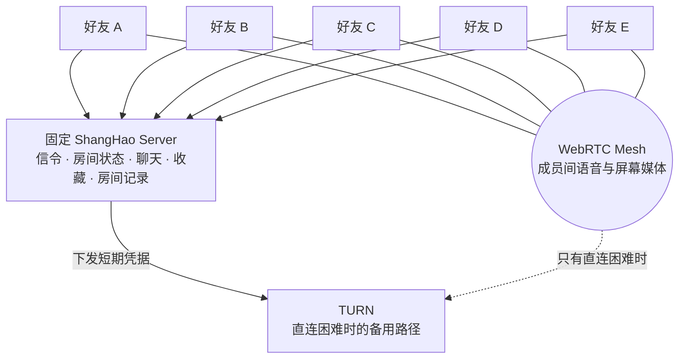
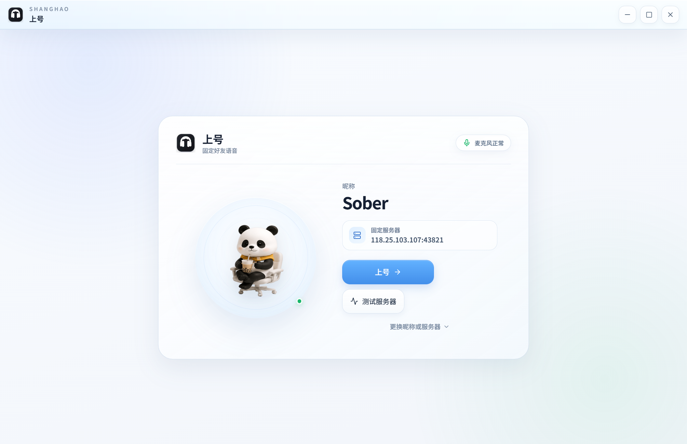
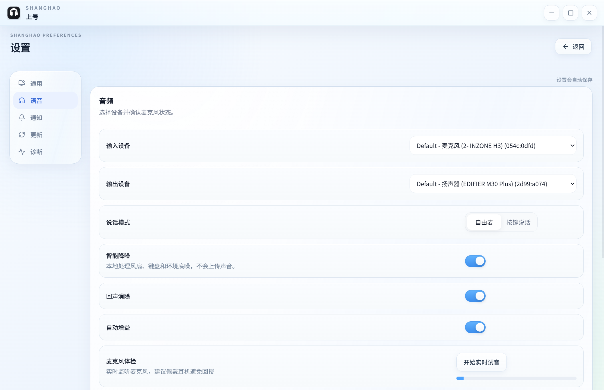
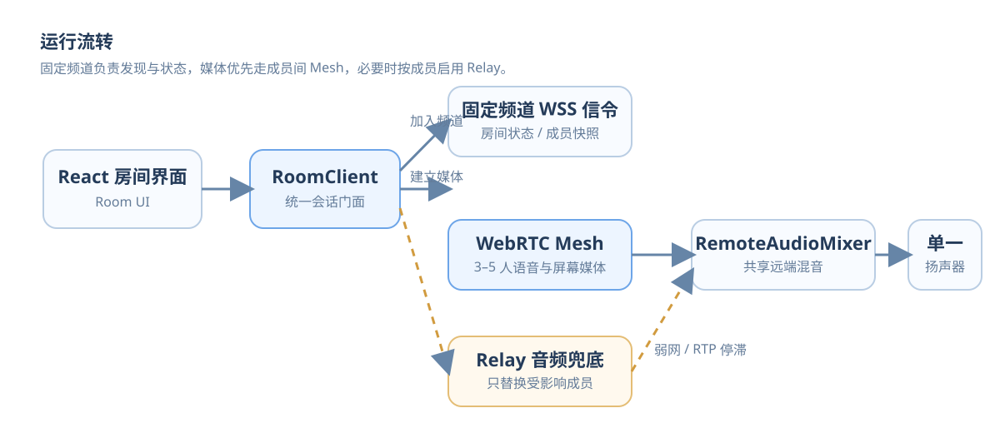
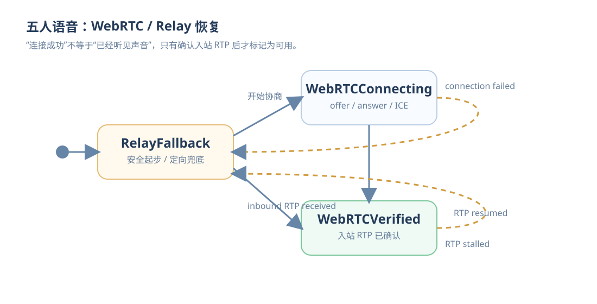
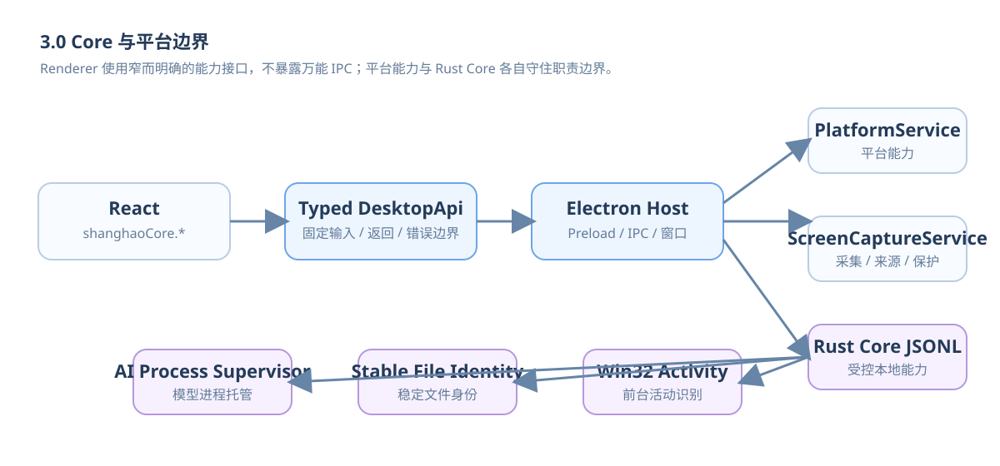

<p align="center">
  
</p>

<h1 align="center">上号 ShangHao</h1>

<p align="center">
  给 3～5 位固定好友准备的轻量、自托管 Windows 开黑语音空间。<br />
  不做社区，不做公会，不做复杂房间。打开上号，朋友就在这里。
</p>

<p align="center">
  <a href="https://github.com/soberbw-hash/shanghao/releases"></a>
  
  
  
  
  <a href="./LICENSE.md"></a>
</p>

<p align="center">
  <a href="#download">下载</a> ·
  <a href="#quick-start">快速开始</a> ·
  <a href="#features">功能</a> ·
  <a href="#server-deployment">部署服务器</a> ·
  <a href="#architecture">架构</a> ·
  <a href="#development">开发</a> ·
  <a href="#faq">FAQ</a> ·
  <a href="#license">许可证</a>
</p>

> [!NOTE]
> 当前桌面客户端正式支持 Windows 10 / 11 x64。仓库中的源码版本可能早于或晚于最新安装包，普通用户请始终以 [GitHub Releases](https://github.com/soberbw-hash/shanghao/releases) 中的正式发布为准。

> [!TIP]
> `main` 当前为 v3.0.0，包含 3.0 Core/Platform 边界、视觉运行时、房间场景、好友响度匹配、录音清理与本地语音记忆，并修复屏幕分享放大模糊和 Windows 防火墙重复规则。完整变化见 [v3.0.0 更新公告](./docs/release-notes/v3.0.0.md)。

## 上号是什么？

上号不是公会大厅，也不是要经营成员、权限和频道树的社区平台。它更像朋友们共同留着的一间小房间：服务器地址固定，一号房和二号房一直在那里，没有房主，不会因为第一个人离开就散掉。

每个人选一个小动物角色。上线后，角色会走进房间、找到工位、坐下；有人说话，角色和悬浮窗会一起给出反馈；有人打游戏、听歌或工作，工位旁会出现适度的状态提示。聊天、收藏、录音和昨日房间，也都围绕这间熟人房间展开。

它适合这样的使用方式：

- 三五个认识很久的朋友，平时一边做自己的事，一边挂在房间里。
- 大家跨地区、跨运营商，希望有一台自己掌控的固定服务器。
- 不想创建临时房间，不想反复发会议链接，也不需要陌生人社区。
- 希望语音处理、录音和大部分个人数据留在自己的电脑上。

如果你需要几十人频道、机器人生态、公开社区或复杂权限系统，ShangHao 不是为那个场景设计的。它主动把规模收在 3～5 人，让房间轻一点，也让每个人都真正看得见。

## 为什么做 ShangHao？

很多语音软件把重点放在“组织”：服务器、频道、身份组、公告、成员管理。固定好友真正需要的往往更简单，只是打开电脑时知道谁在，想说话时能马上听见，暂时离开时也不用解散什么。

ShangHao 想保留这种很具体的感觉：

- 房间属于这群朋友，而不是某一位房主。
- 语音是基础设施，不应该因为第五个人晚加入就变得碰运气。
- 动画不是装饰。走进来、坐下、说话、离开，共同说明房间此刻发生了什么。
- 能在本机完成的处理尽量留在本机，服务器只做必要协调。
- 日常按钮可以直接看见，不为了“界面干净”把常用操作藏进更多菜单。

## 核心设计原则

### 🏠 固定的小房间

一号房和二号房固定存在，语音和聊天彼此隔离。好友用同一个服务器地址进入，不需要谁先开房，也没有“房主掉线，全员结束”的概念。

### 🎙️ 语音可靠性优先

ShangHao 的人数上限不是随便写的数字。五人全互联语音需要 10 条 PeerConnection 和 20 条定向媒体路径。项目为这个真实规模保留了专门的连接恢复、第五人晚加入验证和按成员自愈，而不是只在两个人能通话时就宣布完成。

### 💻 本地优先，服务器轻量

麦克风处理、远端音量、录音、活动识别和本地模型资源都由客户端承担。固定服务器负责房间信令、状态、聊天、收藏、房间记录和临时 TURN 凭据，不承担常态下的五人中央混音。

### 🐾 状态应该看得懂

角色动作、说话颜色、工位屏幕、音乐和工作图标都在回答同一件事：朋友现在大概在做什么。它们不会替代隐私边界，也不会读取文档正文或游戏内容。

### 🧰 自托管不该先考 Linux

正式部署仍然需要一台公网 Ubuntu 服务器，但仓库提供了 Relay、Caddy、WSS、systemd 和 TURN 脚本。README 会把每一步展开，不要求使用者先懂反向代理或 NAT。

<a id="features"></a>

## ✨ 功能一览

### 🎙️ 1. 五人实时语音

ShangHao 面向 3～5 位固定好友，媒体优先通过 WebRTC Mesh 在成员之间传输。简单说，一个人的网络出问题，不应该把整个房间一起重连。

- 使用 Opus 语音，启用 FEC 与 DTX，兼顾弱网恢复和静音时的带宽。
- 五人房间建立 10 条成员间连接，并检查 20 条定向接收路径。
- 每位好友独立进行 ICE restart、连接重建和媒体恢复。
- 直连困难时使用服务器下发的短期 TURN 凭据；必要时还有按成员启用的低带宽语音兜底。
- 延迟和连接质量经过平滑后显示，减少数字不停跳动带来的干扰。
- 每位好友都有只影响本机的 0～300% 音量和本地静音，100% 处设有明确吸附点。
- 扬声器菜单提供默认开启的“好友响度匹配”，以约 -14 LUFS 为目标平滑不同好友的说话响度，并保留逐人音量设置和防削波余量。
- 共享远端音频混音器负责输出设备和逐成员音量，好友不会因为你本地调小音量而受到影响。

### 🎧 2. 本地人声处理

麦克风设置集中在房间左下角，不需要在多个页面来回找开关。

- 输入设备、输出设备、麦克风发送音量和扬声器音量。
- 回声消除、DeepFilterNet 3 智能降噪、自动增益、人声增强、低切与语音均衡。
- 48 kHz AudioWorklet 处理链、说话检测和房间/悬浮窗状态同步。
- DeepFilter 处理异常时回到原声直通，避免把“降噪失败”变成“完全没声音”。
- 结合 VAD、远端参考电平和回声相关性，在环境噪声、远端回声、近端说话与双讲之间切换处理强度；近端人声出现时降低抑制并混入少量原声，保护句首和双讲内容。
- 全局静音快捷键和按键说话设置可在设置页调整。

这些音频处理都在用户电脑上完成，不会为了降噪把麦克风样本上传到第三方服务。

### 🏠 3. 一号房与二号房

- 两个房间固定存在，没有房主。
- 两边的成员、语音、聊天、收藏和房间记录按房间隔离。
- 顶部同时显示两个房间的人数，方便判断朋友在哪里。
- 切换房间会串行清理旧会话、分享、角色和悬浮窗状态，避免重复占位和残留画面。
- 信令短暂断开时使用会话令牌恢复，尽量回到原来的房间和座位。

### 🐶 4. 五个角色与空间房间

五个动物角色对应五个固定工位。角色不是头像列表，而是房间中的参与者。

- 入场、行走、落座、待机、说话、换座和离场动画。
- 可打断的移动状态，切房或离开时不会把角色卡在半路。
- 换座时本地成员快照与服务器状态同步，避免好友状态消息把角色偶发弹回旧座位；服务器仍负责处理真实座位冲突。
- 说话、静音和普通状态使用一致的头像、文字与边框反馈。
- 支持“敲一下”和快捷消息提醒；快捷消息有发送冷却，避免连续轰炸。
- 好友角色可打开本地音量浮层；房间外的悬浮窗也能持续看到成员状态。
- 房间顶部加入只显示今日日期的挂历、模拟时钟和动态天气窗；天气优先使用系统定位，也支持全国城市检索、自定义地点和省资源效果。
- 空闲工位使用与房间一致的轻动画屏幕，不再把默认状态伪装成某个游戏或软件。

### 💬 5. 房间聊天

聊天是房间的一部分，不是另一个复杂的社交系统。

- 发送文字、图片和链接；图片可从桌面拖入或从剪贴板粘贴，发送前会压缩。
- 链接显示紧凑预览，点击用系统默认浏览器打开，右键可直接复制。
- 图片使用统一缩略图，点击后查看大图，并能用左右按钮浏览同一聊天记录中的图片。
- 文字、图片和链接都支持复制、撤回、拖入收藏，连续消息会自动分组。
- 普通消息支持 Windows 原生通知。
- 消息先显示“发送中”，只有服务器确认收到才进入成功状态；短暂断网会重试，同一消息按 ID 去重。
- 服务器持久化最近 100 条普通聊天，本机也保留近期历史；覆盖更新不会主动清空聊天记录。

### ⭐ 6. 房间收藏

收藏是朋友们共享的小箱子。文字、链接、图片和游戏内容可以从聊天区拖到收藏按钮，也可以在收藏窗口直接添加。内容会按房间保留，直到有人手动删除，不受聊天历史条数影响。

收藏里的链接可以打开，文字和图片可以复制；新增内容会给没有看过的成员留下提示点。它适合存下次开黑时间、攻略链接、一张截图或一句约定。

### 🖥️ 7. 屏幕分享

- 列出可分享的显示器和窗口，并避开应用自己的无限镜像。
- 固定 1440p 清晰画质，可选择携带系统音频。
- 支持取消、失败后重试、停止分享和独立观看窗口。
- 观看窗口可以调整大小，使用受限 Preload，不向页面暴露任意 Node.js 能力。
- 切房、退出或分享端断开时统一清理媒体轨道和过期状态。

### 📼 8. 自动录音与录音库

录音保存在本机，默认可以在进入频道后自动开始，并在离开时直接存入录音库。

- 自动录音并保存，也可在房间中手动开始和结束。
- 使用 M4A / AAC，保存目录可以更改并记住。
- 文件按房间、日期和当天编号命名；录音库按日期、房间与收藏筛选。
- 播放、暂停、拖动进度、上一条、下一条，以及 1× / 1.5× / 2× 循环倍速。
- Marker 会显示在时间轴上，点击即可跳到对应时刻。
- 单条录音可收藏或删除；列表支持多选和批量删除。
- “清理录音”会检查不足 10 秒、近似静音和无法读取的废录音，收藏或带 Marker 的录音不会进入批量清理候选。
- 存储上限默认 10 GB，超过后从最旧录音开始整理，并至少保留一条录音。
- 录音完成后可直接打开保存文件夹，路径以适合阅读的方式显示。

### 🧠 9. 本地 AI 语音记忆（开发版）

当前 `main` 已把本地模型管理接入录音库，并建立转录、说话人确认、整理、搜索和问答的数据链路。模型、转录结果与任务检查点都留在本机；这套能力仍处于真实录音验证阶段，识别准确率、长录音处理和不同设备兼容性尚未作为正式版本承诺。

当前开发版包括：

- VibeVoice（约 1.6 GB）与 Qwen3.5-4B（约 8.7 GB）的独立模型状态。
- 首次由用户主动下载，不把数 GB 权重塞进安装包，也不首次启动偷偷下载。
- 下载、暂停、继续、删除、进度显示和断点续传。
- 旧模型可用时先保留旧版，新版下载完整后再切换。
- 游戏运行时降低下载和 AI 任务优先级，支持“游戏结束后处理”等模式。
- 任务检查点、磁盘空间检查，以及 Qwen 空闲后释放资源的调度接口。
- 模型目录与程序安装目录分离，覆盖升级不会把已下载模型当旧程序文件清理。
- 录音库内显示转录进度、错误原因和已有内容，并支持从头重新转录失败或旧管线结果。
- 低质量、乱码、长重复文本和无可靠人声结果会被质量门禁拦截，避免把明显错误的输出当作成功内容保存。
- 语音房、屏幕分享、Peer 恢复或内存压力较高时降低 AI 下载和推理资源占用，优先保护实时语音。

设置中的“自动转录”和“自动整理”会在缺少模型时明确提示依赖。当前仍建议先用短录音确认本机 Runtime 可用，再处理长录音；失败项可以重新转录，不需要删除原始录音。

### 🎮 10. 游戏状态识别

ShangHao 可以在工位屏幕和状态栏中显示当前最前方窗口对应的受支持游戏。KK 平台本体不会再被当作正在玩；只有 KK 真正启动了游戏且游戏位于前台时，才显示“KK 对战平台”。

- 只根据明确的进程名、路径证据和窗口状态识别。
- 不注入游戏，不模拟输入，不读取游戏内存。
- 图标来自本机程序或已登记的识别资源，不上传游戏内容。
- 完整名单见 [支持的游戏与工作软件](./docs/supported-activities.md)。

### 💼 11. 工作软件与音乐状态

工作状态可以显示 Codex、开发工具、Adobe 创作软件、工程工具等受支持应用。它优先关注有主窗口、近期处于前台的程序，不读取项目名、文档内容或聊天内容；用户可在设置中关闭“显示好友正在进行的工作”。

音乐状态独立于这个开关，当前识别 Spotify、Apple Music、网易云音乐和 QQ 音乐，并显示应用及可获得的媒体会话信息。完整工作软件名单同样在 [supported-activities.md](./docs/supported-activities.md) 中维护。

### 📊 12. 昨日房间

“昨日房间”回答的不是谁最活跃，而是昨天这间小房间发生了什么。

- 谁来过、房间亮了多久、最高同时在线几人。
- 发过多少普通消息、开过几次屏幕分享。
- 朋友玩过哪些游戏，以及可统计到的活动时长。
- 最后谁离开。
- 一号房和二号房分别保留最近 14 个完整的上海自然日。

它不做说话时长排行榜、活跃度排名，也不评价谁最摸鱼。进入房间时可以看到昨日卡片，之后也能在设置中重新打开。

### 🔔 13. 更新系统

- 通过 GitHub Releases 检查和下载正式更新。
- 显示下载进度，在用户确认后重启安装。
- 更新中心提供面向普通用户的说明和完整离线历史。
- 客户端版本与服务器协议共同校验，避免不兼容版本混入同一房间。
- 覆盖更新保留设置、聊天、收藏、录音、房间记录和 AI 模型等用户数据。
- NSIS 安装器使用安装根标记和文件清单，只清理确认属于 ShangHao 的旧文件，不递归删除用户放进自定义目录的其它内容。

### 🪟 14. Windows 桌面体验

- Windows 10 / 11 x64 桌面应用、系统托盘和单实例运行。
- 可关闭的开机启动、计划任务启动和应用级防火墙规则。
- `shanghao://` Deep Link 邀请，点击链接可唤起应用并带入服务器与房间信息。
- Windows 原生通知、系统默认浏览器打开链接、录音目录选择和打开文件夹。
- 轻量语音悬浮窗显示成员状态；鼠标停留约 1 秒后出现移动与恢复位置操作，可沿垂直方向吸附移动且不会移出屏幕。
- 全局静音与按键说话快捷键。

### 🩺 15. 诊断与自愈

设置页可以导出诊断包，帮助判断“是服务器没通，还是某位好友的媒体路径没恢复”。

- Relay 健康状态、协议和构建兼容性。
- TURN 配置、可用传输和短期凭据获取结果。
- 每位好友的 WebRTC、ICE、语音兜底与重连状态。
- 麦克风处理状态、输出路径和 `audio-timeline.json` 时间线。
- 自动 ICE restart、按成员媒体重建和信令退避重连。
- 防火墙与服务器连通性检查。

诊断日志不会保存用户语音、录音内容、完整聊天正文、TURN 共享密钥、完整 SDP 或带 Token 的服务器查询参数。

<a id="download"></a>

## 📥 下载与快速开始

普通用户请前往 [GitHub Releases](https://github.com/soberbw-hash/shanghao/releases)，下载名称类似下面的 Windows 安装包：

```text
ShangHao-版本-Setup-x64.exe
```

> [!IMPORTANT]
> 官方版本只通过本仓库和本仓库的 GitHub Releases 发布。请勿从不明网盘下载重新打包版本。若 Windows SmartScreen 对未建立信誉或未签名的安装包提出提醒，请先核对下载来源、版本和 Release 中提供的校验信息，不要直接忽略来源风险。

<a id="quick-start"></a>

## 🚀 3 分钟开始使用

1. **准备同一个服务器地址**<br />
   由一位朋友部署固定服务器，并把完整地址私下发给大家，例如：

   ```text
   wss://voice.example.com/?token=一段私密Token
   ```

2. **安装并打开 ShangHao**<br />
   第一次启动时选择昵称、角色、麦克风和扬声器。服务器地址只需填写一次，之后会保存在本机。

3. **测试服务器**<br />
   在首页点击“测试服务器”。显示服务器正常后，进入一号房或二号房。

4. **检查声音**<br />
   默认是否闭麦取决于当前本机设置。点击左下角麦克风主体切换静音，点旁边箭头调整设备、人声处理和发送音量；扬声器设置同理。

5. **邀请朋友**<br />
   房间里的邀请按钮会生成 `shanghao://` 链接。对方已安装 ShangHao 时，点击即可唤起应用并准备进入对应房间。邀请链接可能包含服务器 Token，只适合私下发送。

进入一次后，以后通常只需要打开软件并“上号”。

<details>
<summary><strong>第一次使用时常见的 Windows 提示</strong></summary>

- **防火墙提示**：允许 ShangHao 进行需要的网络通信，否则 WebRTC 和 TURN 可能受限。
- **麦克风权限**：拒绝后无法采集语音，可在 Windows 设置中重新开启。
- **管理员权限**：正式包按当前配置请求管理员权限，用于安装、防火墙和启动相关能力。
- **默认浏览器 / Deep Link**：首次点击 `shanghao://` 时，Windows 可能询问是否允许打开 ShangHao。

</details>

<a id="architecture"></a>

## 🏗️ 它是怎么工作的？


```mermaid
flowchart TB
  A["好友 A"]
  B["好友 B"]
  C["好友 C"]
  D["好友 D"]
  E["好友 E"]
  M(("WebRTC Mesh<br/>成员间语音与屏幕媒体"))
  S["固定 ShangHao Server<br/>信令 · 房间状态 · 聊天 · 收藏 · 房间记录"]
  T["TURN<br/>直连困难时的备用路径"]

  A --- M
  B --- M
  C --- M
  D --- M
  E --- M

  A --> S
  B --> S
  C --> S
  D --> S
  E --> S

  S -->|"下发短期凭据"| T
  M -. "只有直连困难时" .-> T
```

正常情况下，服务器不是五个人语音的中央混音服务器。它帮助大家找到彼此、维护两个固定房间、保存轻量共享数据，并在复杂网络下提供 TURN 临时凭据。音频处理、远端混音、录音和活动识别仍在各自电脑上完成。

这也是 ShangHao 的技术取舍：**客户端可以重，服务器必须轻。** 对 3～5 人固定房间来说，成员间 Mesh 能换来更直接的媒体路径和按好友恢复能力；人数继续扩大时，这个方案就不再合适。

### 3.0 产品与架构速览

<p align="center">
  
  
</p>

下面三张图就是仓库架构文档中的核心图，直接放在 README，打开 GitHub 首页即可查看；对应的 Mermaid 源码和文字说明仍保留在 [架构文档](./docs/architecture.md)。

#### 运行流转：信令、Mesh 与音频兜底

<p align="center">
  
</p>

#### 五人语音：WebRTC / Relay 恢复状态

<p align="center">
  
</p>

#### 3.0 Core 与平台边界

<p align="center">
  
</p>

界面截图、WebRTC Mesh、Relay 回退、屏幕分享边界与 3.0 Core/Platform 分层的完整说明见 [架构文档](./docs/architecture.md)。

<a id="server-deployment"></a>

## 🌐 自己部署一个 ShangHao 服务器

服务器主要负责房间信令、成员状态、普通聊天、收藏、昨日房间、TURN 临时凭据和少量共享数据。它不负责 DeepFilter 降噪、录音、AI 模型推理，也不做常态下的五人中央语音混音。

下面是一套面向第一次自托管的完整流程。已经熟悉 Linux 的用户可以直接查看 [固定频道部署文档](./docs/deploy-relay-server.md) 和 [TURN 部署文档](./docs/deploy-turn.md)。

### 1. 准备服务器

建议配置：

- Ubuntu 22.04 或 24.04。
- 2 核 CPU、2 GB 内存起步。
- 公网 IPv4。
- 推荐准备一个域名，例如 `voice.example.com`。
- 可以通过 SSH 登录，并拥有 `sudo` 权限。

对五位固定好友来说，Relay 本身很轻。真正可能占用媒体带宽的是 TURN，而且只在成员无法直接连接时使用。选择服务器地域时，优先考虑几位朋友共同的网络延迟，而不是盲目购买高配置。

### 2. 让域名指向服务器

在域名服务商的 DNS 控制台新增一条 **A 记录**：

```text
主机记录：voice
记录类型：A
记录值：1.2.3.4（你的服务器公网 IPv4）
```

完成后，它表达的是：

```text
voice.example.com → 1.2.3.4
```

正式客户端将通过下面的加密 WebSocket 地址连接：

```text
wss://voice.example.com/
```

Caddy 会在部署时自动申请和续期 HTTPS 证书。DNS 生效可能需要几分钟到数小时；如果证书申请失败，先确认域名已经解析到这台服务器。

### 3. 开放安全组和防火墙

“安全组”就是云服务器外层的防火墙。腾讯云、阿里云、AWS 或其它服务商叫法可能不同，但要开放的端口相同。

| 端口        | 协议 | 用途                       | 是否必须                       |
| ----------- | ---- | -------------------------- | ------------------------------ |
| 80          | TCP  | Caddy 申请证书和 HTTP 跳转 | 使用域名部署时需要             |
| 443         | TCP  | WSS 加密连接               | 正式部署需要                   |
| 3478        | UDP  | TURN 首选传输              | 强烈建议                       |
| 3478        | TCP  | UDP 不可用时的 TURN 备用   | 强烈建议                       |
| 49160-49220 | UDP  | TURN 媒体端口池            | 安装 TURN 时需要               |
| 5349        | TCP  | 标准 TURNS                 | 仅启用 TURN TLS 时需要         |
| 43821       | TCP  | 裸 WebSocket Relay         | 只在无域名临时测试时对公网开放 |

来源可以先设为 `0.0.0.0/0`。Relay Token 和 TURN 的短期 HMAC 凭据承担访问控制；如果你的朋友都有稳定出口 IP，也可以进一步收紧来源。

### 4. SSH 进入服务器并下载仓库

在服务器终端执行：

```bash
git clone https://github.com/soberbw-hash/shanghao.git
cd shanghao
```

如果服务器还没有 `git`，先运行：

```bash
sudo apt-get update
sudo apt-get install -y git
```

### 5. 一键部署 Relay + WSS

把示例域名换成自己的：

```bash
sudo SHANGHAO_DOMAIN=voice.example.com bash scripts/deploy-relay-ubuntu.sh
```

脚本会自动完成：

- 检查 Ubuntu，安装 Node.js 22、Corepack 和 pnpm。
- 在 `/opt/shanghao` 安装或更新代码。
- 创建不可登录的 `shanghao` 系统用户。
- 安装依赖并构建 signaling Relay。
- 创建 `/opt/shanghao/.env`，首次生成私密 Relay Token。
- 把聊天等持久化数据放在 `/opt/shanghao/data`。
- 写入带安全限制的 systemd 服务，并设置开机启动。
- 安装 Caddy，把站点配置放进独立片段，启用 WSS。
- 启动服务并调用 `/health` 做基础检查。

脚本不会用一份新配置覆盖已有 `/opt/shanghao/.env`，也不会重置已有 Token。它不会删除数据目录；Caddy 配置变更前会备份，验证失败会恢复旧配置。

### 6. 找到 Relay Token

第一次安装生成的 Token 位于服务器，不在客户端仓库中。查看命令：

```bash
sudo grep '^RELAY_ACCESS_TOKEN=' /opt/shanghao/.env
```

把值拼到客户端地址：

```text
wss://voice.example.com/?token=你的RELAY_ACCESS_TOKEN
```

> [!CAUTION]
> Relay Token 相当于这间房间的钥匙。只私下发给朋友，不要放进公开 README、Issue、截图或诊断附件。若 Token 已泄露，请在服务器上生成新值、修改 `.env` 并重启 Relay。

### 7. 安装 TURN

#### 为什么强烈建议安装？

不同省份、不同运营商、校园网、公司网或复杂 NAT 之间，有时无法建立稳定的点对点媒体连接。TURN 像一条备用中转路线：直连走不通时，才帮助媒体抵达另一位好友。

在已经部署好的服务器上执行：

```bash
cd /opt/shanghao
sudo bash scripts/install-turn.sh
```

脚本会：

- 安装并启用 coturn。
- 自动识别公网 IPv4，也允许通过 `TURN_EXTERNAL_IP` 手动指定。
- 生成 `TURN_SHARED_SECRET`。
- 配置 UDP/TCP 3478 和 UDP 49160-49220 媒体端口池。
- 把 TURN 地址与共享密钥写入 `/opt/shanghao/.env`。
- 开放启用中的 UFW 端口并重启 coturn 与 ShangHao Relay。

`TURN_SHARED_SECRET` **永远不要发给客户端**。Relay 使用它生成有时效的临时用户名和密码，客户端只拿临时凭据。

如果要启用 TURNS 5349，需要提供可读的证书和私钥。完整参数、443 端口冲突保护和验证方式见 [docs/deploy-turn.md](./docs/deploy-turn.md)。普通家庭朋友房间先把 UDP/TCP TURN 配好即可。

### 8. 验证服务

在服务器执行：

```bash
curl -fsS http://127.0.0.1:43821/health
sudo systemctl status shanghao-relay --no-pager
sudo journalctl -u shanghao-relay -f
```

安装 TURN 后再检查：

```bash
sudo systemctl status coturn --no-pager
```

`/health` 返回包含下面字段的 JSON，说明 Relay 基本正常：

```json
{ "ok": true }
```

健康接口还会给出协议、构建、在线人数和 TURN 是否配置，但不会返回 Relay Token 或 TURN 共享密钥。要进一步检查短期 TURN 凭据，请按 [TURN 文档](./docs/deploy-turn.md) 使用带 Bearer Token 的 `/ice-config`。

最后在 Windows 客户端首页点击“测试服务器”。服务器健康只代表 Relay 可用，真实语音仍建议让两位不同网络的朋友进入房间试一次。

### 9. 日常维护

查看状态、日志和重启：

```bash
sudo systemctl status shanghao-relay --no-pager
sudo journalctl -u shanghao-relay -n 100 --no-pager
sudo systemctl restart shanghao-relay
sudo systemctl status coturn --no-pager
```

更新服务器代码时，先更新你用来执行脚本的仓库，再重新运行部署脚本：

```bash
cd ~/shanghao
git pull --ff-only
sudo SHANGHAO_DOMAIN=voice.example.com bash scripts/deploy-relay-ubuntu.sh
```

脚本会对 `/opt/shanghao` 执行快进更新、重新安装依赖、构建并重启服务，同时保留已有 `.env`、Token 和 `/opt/shanghao/data`。如果你修改过服务器源码或部署目录里存在未提交改动，请先自行备份和合并，不要假设自动更新能替你处理 Git 冲突。

建议定期备份：

```text
/opt/shanghao/.env
/opt/shanghao/data/
```

`.env` 含有密钥，备份也应加密并限制访问。

### 10. 没有域名时临时测试

可以先运行：

```bash
sudo bash scripts/deploy-relay-ubuntu.sh
```

开放安全组 TCP 43821，然后在客户端填写：

```text
ws://服务器公网IP:43821/?token=你的RELAY_ACCESS_TOKEN
```

> [!WARNING]
> 公网 `ws://` 没有 TLS，只适合短时间排障。它不应该成为长期朋友频道的正式地址。确认功能后，请配置域名并改用 `wss://`。

<details>
<summary><strong>部署失败时先看这几项</strong></summary>

1. 域名 A 记录是否真的指向当前公网 IPv4。
2. 云安全组是否开放 TCP 80、443；安装 TURN 后是否开放 3478 和 UDP 49160-49220。
3. `sudo systemctl status shanghao-relay --no-pager` 是否显示 active。
4. `sudo journalctl -u shanghao-relay -n 100 --no-pager` 的第一条真实错误是什么。
5. `/opt/shanghao/.env` 是否存在，但不要把完整内容贴到公开 Issue。
6. 服务器 443 是否已被另一个反向代理占用。部署脚本会把 ShangHao 写入独立 Caddy 片段，不会主动替换其它网站配置。

</details>

## 🔒 隐私与安全

ShangHao 采用“本地优先、服务器轻协调”的边界，但自托管并不自动等于绝对安全。部署者和使用者都需要保管好自己的服务器、Token 和录音文件。

### 数据在哪里

| 数据                         | 默认位置或流向                       |
| ---------------------------- | ------------------------------------ |
| 麦克风处理                   | 用户电脑本地                         |
| WebRTC 语音与屏幕媒体        | 成员之间优先直连，困难时经 TURN      |
| 好友本地音量和静音           | 当前用户电脑本地                     |
| 录音、Marker、录音收藏       | 用户选择的本地录音目录               |
| 设置与本地聊天历史           | Electron 用户数据目录                |
| 普通聊天、房间收藏、昨日房间 | 自托管 Relay 的 `/opt/shanghao/data` |
| AI 模型与任务状态            | 用户电脑本地、独立于安装目录         |
| 游戏和工作状态               | 本机识别后只同步必要的状态名称/标识  |

### 明确不会做的事

- 不把麦克风样本上传到第三方降噪服务。
- 不注入游戏进程，不读取游戏内存，不模拟用户按键。
- 不读取工作软件里的文档正文、项目代码或聊天内容。
- 不把 TURN 共享密钥下发给客户端。
- 不在诊断包中放入录音、AI 转写内容、完整聊天正文、完整 SDP 或敏感 Token。
- 不在首次安装后偷偷下载数 GB AI 模型。

### Electron 安全边界

主窗口、设置窗口和悬浮窗保持 `contextIsolation: true`、`nodeIntegration: false` 与沙箱。渲染层需要文件、剪贴板、通知或系统能力时，通过窄化的 Preload / IPC 调用 Main Process，而不是直接取得 `fs`、`child_process` 或任意 Electron API。

外部链接只允许 `http:` / `https:`，聊天历史服务器只接受 `ws:` / `wss:`；录音播放使用受控的自定义媒体协议。诊断输出会清理服务器查询参数。

### 自托管者的责任

- 把 `RELAY_ACCESS_TOKEN` 和 `TURN_SHARED_SECRET` 当成密码保管。
- 及时更新 Ubuntu、Caddy、Node.js 与 ShangHao Server。
- 限制服务器 SSH 登录，启用密钥认证和云平台安全组。
- 备份 `/opt/shanghao/data` 前先确认其中是否包含朋友不希望公开的聊天和房间记录。
- 公开提交问题前检查诊断附件，避免额外附上私人截图或 `.env`。

## 📁 项目结构

```text
shanghao/
├─ apps/
│  └─ desktop/                 Electron 主进程、Preload 与 React 界面
├─ packages/
│  ├─ shared/                  协议、IPC、设置与共享类型
│  ├─ signaling/               固定房间 Relay、聊天与轻量共享状态
│  ├─ webrtc/                  WebRTC、音频与说话检测基础能力
│  ├─ recording/               录音状态机、编码与导出
│  ├─ ui/                      可复用 UI 基础
│  ├─ desktop-pet/             角色资源相关包
│  └─ network-repair/          Windows 网络修复能力
├─ scripts/                    开发、验证、部署与发布辅助脚本
├─ deploy/                     Caddy 等部署示例
├─ docs/                       部署、架构、活动名单与版本说明
├─ LICENSE.md                  AGPL-3.0-or-later 许可入口
├─ NOTICE.md                   作者与法律声明
├─ TRADEMARKS.md               品牌和官方身份边界
└─ THIRD_PARTY_NOTICES.md       第三方依赖声明
```

房间通信对外仍以 RoomClient 作为统一入口，内部按 signaling、Peer 操作队列、可靠聊天、屏幕画面兜底和屏幕音频混音等职责组织。React 页面负责组合场景、聊天和控制区，WebRTC、录音、AI 和系统能力留在各自功能域中。

<a id="development"></a>

## 🛠️ 本地开发

### 环境

- Windows 10 / 11 x64。
- Node.js 22 LTS。
- Corepack。
- Git。
- 项目锁定的 pnpm 版本由 `packageManager` 字段管理。

### 安装与启动

```powershell
git clone https://github.com/soberbw-hash/shanghao.git
cd shanghao
corepack enable
corepack pnpm install --frozen-lockfile
corepack pnpm dev
```

开发模式会启动 Electron 桌面端。若只想启动本地 signaling Relay：

```powershell
corepack pnpm relay
```

默认本地地址为：

```text
ws://127.0.0.1:43821/
```

### 常用检查

```powershell
corepack pnpm lint
corepack pnpm typecheck
corepack pnpm test
corepack pnpm test:audio-worklet
corepack pnpm test:five-peer-audio
corepack pnpm test:five-peer-media
corepack pnpm build
```

- `test:audio-worklet` 在真实 Electron 渲染环境创建 48 kHz AudioContext 与 AudioWorklet 节点。
- `test:five-peer-audio` 创建 A～E 五个客户端，检查每个人到另外四人的 20 条语音兜底路由。
- `test:five-peer-media` 建立五端全互联 WebRTC，检查 20 条定向媒体路径、第五人晚加入和一组连接的双向恢复。
- 自动化验证不能替代不同 Windows 电脑、不同运营商和真实耳机/扬声器的最终验收。

正式安装包只应在明确的发布流程中构建：

```powershell
corepack pnpm dist:win
```

本地开发、文档修改或普通 Pull Request 不需要反复打安装包。

<details>
<summary><strong>仓库中的版本与正式发布为什么可能不同？</strong></summary>

`main` 分支可能正在准备下一个版本，因此 `package.json` 中的版本号不一定已经对应一个 GitHub Release。安装用户看 Releases，开发者看当前分支和 [CHANGELOG](./CHANGELOG.md)，两者不要混为一谈。

</details>

## 技术栈

| 层级       | 主要技术                                         |
| ---------- | ------------------------------------------------ |
| 桌面运行时 | Electron 42                                      |
| 界面       | React 19、TypeScript 5.9、Vite 8、Tailwind CSS 4 |
| 动画       | Framer Motion、GSAP、CSS motion tokens           |
| 状态管理   | Zustand                                          |
| 实时通信   | WebSocket、WebRTC、Opus、ICE、STUN / TURN        |
| 本地音频   | Web Audio API、AudioWorklet、DeepFilterNet 3     |
| 录音与媒体 | MediaRecorder、FFmpeg、M4A / AAC、自定义媒体协议 |
| 服务端     | Node.js 22、`ws`、轻量文件持久化                 |
| 部署       | systemd、Caddy、coturn、NSIS / electron-builder  |
| 更新       | electron-updater、GitHub Releases                |

<a id="faq"></a>

## ❓ 常见问题

### 一定需要自己的服务器吗？

日常使用需要一台 ShangHao 固定服务器。你可以自己部署，也可以使用朋友已经部署并愿意共享的服务器。官方仓库没有承诺提供公共房间服务。

### 服务器配置要多高？

3～5 人房间建议 Ubuntu 22.04/24.04、2 核 2 GB 起步。Relay 主要处理信令和轻量数据；TURN 使用时，带宽通常比 CPU 更值得关注。

### 五个人的语音都经过服务器吗？

不是。正常情况下成员之间使用 WebRTC Mesh，服务器不做中央混音。只有直连困难时，相关媒体路径才可能经过 TURN；某条 WebRTC 路径未恢复时，也可能临时启用有界的语音兜底。

### 为什么已经有 WebRTC 还需要 TURN？

因为 NAT、校园网、公司网和运营商策略可能阻止两台电脑直接建立媒体连接。TURN 是直连失败时的备用路线，能明显提高跨网络成功率。

### 没有域名能不能用？

可以用公网 `ws://IP:43821` 做短时测试，但它没有 TLS。长期使用应配置域名和 WSS。

### macOS 或 Linux 桌面能用吗？

当前正式客户端只支持 Windows 10 / 11 x64。服务器运行在 Ubuntu；仓库不提供 macOS 或 Linux 桌面安装包，也不承诺兼容。

### 支持多少人？为什么不继续做大？

目标是 3～5 位固定好友。五人 Mesh 已经包含 10 条成员间连接和 20 条定向媒体路径。继续扩大人数会改变带宽、连接数和产品形态，也会把一个熟人小房间变成另一个社区工具。

### 录音会上传服务器吗？

不会。录音、Marker、收藏状态和播放进度保存在用户电脑。自托管 Relay 不接收录音文件。

### 游戏和工作软件检测会读取内容吗？

不会读取游戏内存、文档正文、项目代码或聊天内容。检测只使用必要的 Windows 进程、路径、窗口和媒体会话证据，也不会注入或模拟输入。

### AI 会自动上传录音或聊天吗？

不会。模型首次需要用户主动下载，录音转录、说话人确认、整理结果和任务检查点保存在本机，原始录音默认不上传。当前开发版已经接入本地推理链，但准确率和长录音稳定性仍需真实设备继续验证。

### 可以搭建自己的 ShangHao 吗？

可以。仓库提供固定 Relay、WSS 和 TURN 部署脚本。服务器也属于 AGPL 覆盖的软件，修改并通过网络向用户提供交互时，需要遵守对应源代码提供义务。

### 可以修改源码或做二次开发吗？

可以。代码使用 GNU AGPL-3.0-or-later。请保留版权和许可证声明，并根据你的分发或网络服务方式履行 AGPL 义务。

### 可以商用吗？

AGPL 不禁止商业使用，但商业发行同样要遵守源代码、许可声明和网络交互条款。源代码许可也不等于获得“上号 / ShangHao”品牌授权。具体项目请让熟悉你发行方式的法律专业人士评估。

### 修改后能不能不开源？

仅供自己私下运行，与向他人分发或通过网络提供交互服务的义务不同。若你分发受 AGPL 覆盖的修改版，需向接收者提供完整对应源代码；若修改后的 AGPL 程序通过网络与用户交互，也需向这些用户提供取得对应源代码的机会。以 [LICENSE.md](./LICENSE.md) 和 AGPL 正文为准。

### 能继续使用“上号”名字、图标和角色吗？

源代码许可证不会自动授予品牌使用权。说明“基于 ShangHao”是合理的来源描述，但公开发布衍生版本时应使用自己的名称和图标，并明确标注“非官方修改版”，不能让用户误以为由 Sober 官方发布。

### 邀请链接为什么打不开？

先确认 ShangHao 已安装并注册 `shanghao://` 协议。若从某些聊天软件点击被拦截，可复制完整链接到系统运行框；链接包含服务器和房间信息时不要发到公开渠道。

### 消息为什么显示“发送中”或“发送失败”？

“发送中”表示客户端还在等待服务器确认。连接恢复后会按同一个消息 ID 重试，避免重复出现；若最终失败，可以点击失败提示重发。持续失败时先测试服务器并查看诊断页。

<a id="license"></a>

## ⚖️ 开源许可与二次开发

ShangHao 程序源代码按 **GNU Affero General Public License v3.0 or later** 发布。

- 项目作者：**Sober / soberbw-hash**
- SPDX：`AGPL-3.0-or-later`
- 许可入口：[LICENSE.md](./LICENSE.md)
- 项目声明：[NOTICE.md](./NOTICE.md)

你可以阅读、运行、学习、Fork、修改和再分发代码。需要特别理解的是：

1. 保留原版权与许可证声明。
2. 向他人分发受 AGPL 覆盖的程序或修改版时，按许可证提供完整对应源代码。
3. 修改后的受覆盖代码继续满足 AGPL 的要求。
4. 修改后的 AGPL 程序通过网络与用户交互时，向这些远程用户提供取得对应源代码的机会。
5. 软件按现状提供，不附带明示或默示担保。

这段说明帮助普通读者理解项目意图，不替代具有法律效力的 AGPL 英文正文，也不是针对具体使用方式的法律意见。

### ❤️ 二次开发时，请保留 ShangHao 的来源

如果你的项目直接使用、复制或修改了 ShangHao 源代码，除了履行 AGPL 和保留原版权声明，也请在 README、About 或许可证说明等明显位置写清来源。推荐格式：

```markdown
### 来源

本项目基于 ShangHao / 上号 修改或二次开发。

原项目：ShangHao
原作者：Sober（soberbw-hash）
项目地址：https://github.com/soberbw-hash/shanghao
许可证：GNU AGPL-3.0-or-later
```

可以根据你的项目调整文字，但不能删除原作者、移除 AGPL、抹去版权声明，或把直接基于 ShangHao 的派生项目描述成完全独立原创。

如果你没有复制或修改 ShangHao 代码，只是受到产品理念、功能或交互启发，AGPL 不会仅因为“想法相似”就自动要求注明 ShangHao。若它确实给了你灵感，欢迎自愿写下灵感来源，这是社区礼貌，不冒充许可证义务。

### ™️ 代码许可不等于品牌授权

AGPL 开放的是程序代码，并不自动授权其它项目使用以下品牌资产冒充官方：

- “上号”与“ShangHao”名称。
- 官方应用图标和组合视觉。
- 动物角色美术。
- 投喂二维码及其它作者品牌资产。

发布衍生版本时，应明确标注“非官方修改版”，建议使用自己的项目名称、图标和品牌。可以真实说明“基于 ShangHao”，但不能暗示原作者背书，也不能替换作者的投喂入口后仍宣称是官方版本。完整边界见 [TRADEMARKS.md](./TRADEMARKS.md)。

> [!WARNING]
> ShangHao 官方版本只通过 [soberbw-hash/shanghao](https://github.com/soberbw-hash/shanghao) 及其明确列出的 GitHub Releases 发布。Fork、二次开发版和重新打包版本不代表原作者背书。

第三方组件继续适用各自许可证。README 不重复粘贴全部许可全文，详见 [THIRD_PARTY_NOTICES.md](./THIRD_PARTY_NOTICES.md)。

## 🤝 参与 ShangHao

欢迎通过 [Issues](https://github.com/soberbw-hash/shanghao/issues) 提交：

- 可以稳定复现的 Bug。
- 特定 Windows 版本、声卡、耳机或网络环境的兼容问题。
- 游戏与工作软件识别补充。
- 自托管、TURN 和跨运营商连接问题。
- 克制且不增加操作负担的 UI 或功能建议。

Pull Request 请尽量保持单一主题，说明测试方式，不要在一次提交中同时重写房间、WebRTC 和界面。涉及五人语音时，请至少运行项目已有的音频与五端媒体检查。

报告问题时建议附上：

- ShangHao 版本和 Windows 版本。
- 是否使用耳机、扬声器或虚拟声卡。
- 双方大致网络环境，例如同城不同运营商。
- 问题发生时间和可复现步骤。
- 设置页导出的诊断包。

请先检查附件，不要公开上传服务器 Token、TURN 共享密钥、私人聊天、录音或包含隐私的截图。

## 📚 更新记录

当前仓库版本为 **3.0.2**，此前正式版本为 3.0.0。

近期几个重要阶段：

- **3.0.2**：修复进房、换座和空闲后台占用，角色位移改用合成层关键帧，语音分析与高刷新率解耦，并修复静音 Peer/过期房间会话的恢复循环；同时完善中文录音转录、整理和三套 ASR 选择。同版本修正版还修复了首批安装包 AI runner 清单哈希错误导致的启动失败。详见 [v3.0.2 更新公告](./docs/release-notes/v3.0.2.md)与 [稳定性参考](./docs/stabilization-reference-3.0.2.md)。

- **3.0.0**：完成 3.0 Core/Platform 与 Rust Core 边界、视觉运行时和诊断链路；继续强化五人语音恢复、屏幕分享、录音库、本地 AI 运行时、场景日历与角色状态显示，并收紧角色状态卡的布局稳定性。详见 [v3.0.0 更新公告](./docs/release-notes/v3.0.0.md)。

- **2.9.2**：提升实时屏幕分享和独立放大窗口清晰度，改善信令兜底画面；修复连续点击防火墙修复导致规则重复、状态一直失败。详见 [v2.9.2 更新公告](./docs/release-notes/v2.9.2.md)。
- **2.9.1**：修复 Windows 已批准显示器或窗口后仍提示无法启动屏幕分享的问题，增加精确来源兼容采集；验证抖音直播间链接会完整保留房间路径。详见 [v2.9.1 更新公告](./docs/release-notes/v2.9.1.md)。
- **2.9.0**：新增好友响度匹配、自适应人声保护、动态天气与今日挂历、空闲工位屏幕、录音批量整理、本地语音记忆链路，并集中修复悬浮窗、角色移动、换座和屏幕分享入口。详见 [v2.9.0 更新公告](./docs/release-notes/v2.9.0.md)。
- **2.8.0**：修复聊天可靠发送、录音播放、Windows 屏幕分享与房间细节；升级桌面底层和安全安装机制，并完成房间代码模块化。
- **2.6.0**：补齐录音库、自动保存、昨日房间、收藏和一批日常房间体验。
- **2.5.0**：集中处理好友本地音量、Apple Music、屏幕分享清理和房间视觉。

版本细节见 [CHANGELOG.md](./CHANGELOG.md)，普通用户说明见 [v3.0.2 更新公告](./docs/release-notes/v3.0.2.md)。

---

<p align="center">
  <strong>上号不是让你管理一个社区，而是让熟悉的人一直有间房。</strong>
</p>
