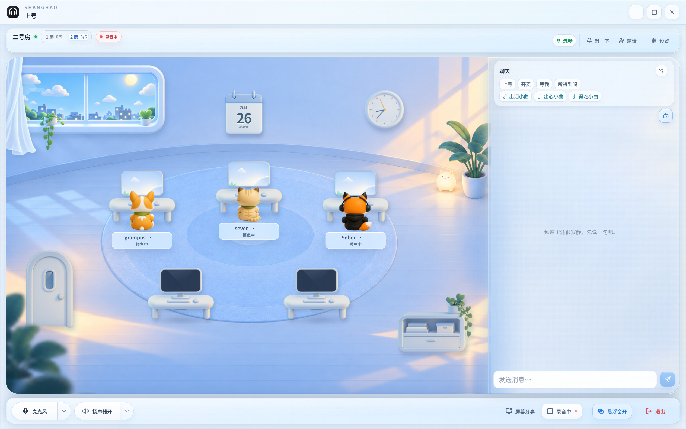
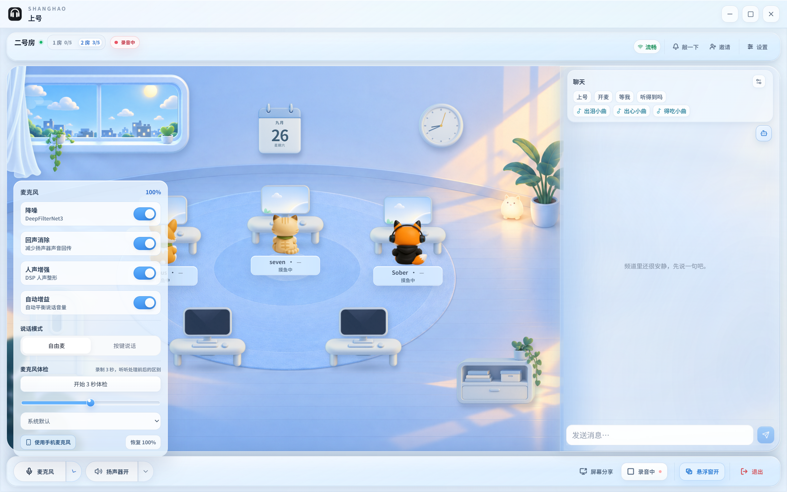
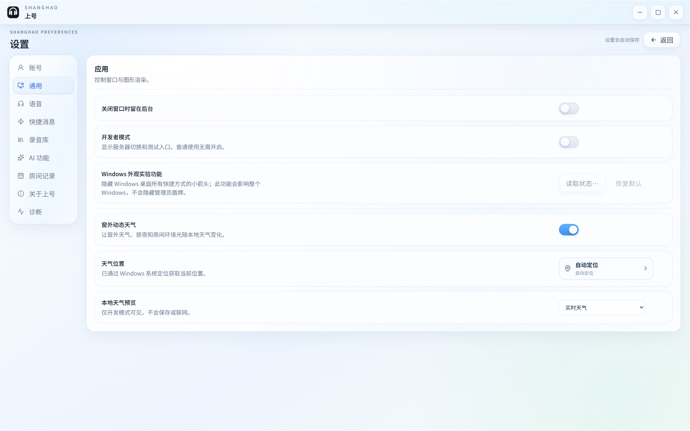

<p align="center">
  
</p>

<h1 align="center">上号 · ShangHao</h1>

<p align="center"><strong>开黑不该像开会。</strong><br />
打开电脑，推门进来。朋友在，声音在，今晚的故事也在。</p>

<p align="center">
  <a href="https://github.com/soberbw-hash/shanghao/releases/latest"></a>
  
  
  <a href="./LICENSE.md"></a>
</p>

<p align="center">
  <a href="https://github.com/soberbw-hash/shanghao/releases/latest">下载 Windows 版</a> ·
  <a href="#这间房里有什么">看看房间</a> ·
  <a href="#三分钟上号">三分钟上号</a> ·
  <a href="#自己搭一间房">自己部署</a> ·
  <a href="#给开发者">参与开发</a>
</p>



<sub>图：当前本地开发版的二号房，使用隔离的本机信令服务和模拟成员拍摄；没有使用真实好友的聊天记录。演示画面不是 v3.1.0 安装包的逐像素截图，也不代表模拟成员之间完成了真实语音通话。</sub>

## 这不是另一个会议软件

它不问你「会议主题是什么」，也不用有人提前开房。固定的一号房、二号房一直在那里。你走进来，小动物找到自己的工位坐下；朋友说话，房间亮起反馈；游戏打到一半，顺手扔个链接，结束后还能找回那段录音。

上号把五位以内的熟人体验当成主角，而不是把百人频道缩小。它有聊天、快捷消息、共享收藏、屏幕分享、录音库、游戏与音乐状态，也有认真对待弱网和晚加入成员的语音底座。功能不少，目标只有一个：让「上号吗？」之后的步骤少一点。

> **适合** 固定朋友、跨城开黑、边玩边聊、想自己掌握服务器的小团队。**不适合** 公开社区、百人语音、公会管理或复杂权限体系。

## 这间房里有什么

| 你看到的                  | 真正在发生的                                                                                                    |
| ------------------------- | --------------------------------------------------------------------------------------------------------------- |
| 🐾 **朋友坐下了**         | 五个工位容纳最多五位成员；角色、昵称、延迟和说话状态跟房间成员同步。账号头像用于聊天和悬浮窗。                  |
| 🎙️ **开口就聊**           | WebRTC Mesh + Opus；按成员处理 ICE/连接恢复，必要时借助 TURN 或低带宽语音兜底。不是「一个人掉线，全房重新来」。 |
| 🎚️ **声音有自己的调音台** | 本地回声消除、DeepFilterNet3 降噪、自动增益、人声增强、麦克风体检；每位好友的音量只影响你自己。                 |
| 💬 **话题不必停在语音里** | 两间房分别聊天，支持快捷消息、图片与链接、发送确认、重试和去重。                                                |
| 📌 **好东西别埋在消息里** | 消息或链接可以收进共享收藏；录音和 Marker 帮你找到值得重听的瞬间。                                              |
| 🖥️ **「你看我屏幕」**     | 房间内屏幕分享和观看，不用跳出小房间另开会议。                                                                  |
| 🎮 **人在，状态也在**     | 支持的游戏、音乐、动态天气和昼夜窗景让房间有生活感；游戏识别不注入进程或读取游戏内存。                          |

### 一晚上的组合技

**20:31，朋友陆续进房。** 谁在、谁坐哪、谁开麦，房间自己交代。有人先玩英雄联盟，有人还在等三角洲更新，不必用十条消息报备。

**21:07，「看这里！」** 开屏幕分享，链接扔进聊天；重要的攻略收进收藏。语音继续走自己的链路，分享不是把房间变成会议软件。

**23:48，「刚才那句太离谱了。」** 打开本机录音库找 Marker。第二天还能回看房间记录。能记住的记住，想忘掉的本地数据也由你自己管理。

### 一张图，看懂「在一起」



<sub>图：本地开发版的麦克风面板。图中的「使用手机麦克风」入口仍需手机 HTTPS 配对服务部署与实机验收，**当前不能当作已可用功能**。</sub>

左边是能看见彼此的房间，右边是不用喊着打断人的聊天。声音处理留在本机，好友也能各自调节接收音量；可选的好友响度匹配以约 -16 LUFS 为平滑目标。房间不是简单贴一张壁纸：角色入座、状态变化、天气和时间共同告诉你「现在谁在这里」。

### 不只是当晚的声音

录音可以在本机保存到录音库，按房间和日期查找，打 Marker、收藏、回放。开发版还在探索本地 AI 语音记忆：转录、说话人确认、整理和搜索围绕本地录音建立；模型推理与长录音准确性仍在验证，**不作为正式版能力承诺**。可选云端问答涉及所连接的自托管服务，是否启用由部署者决定。



<sub>图：本地开发版的设置页，展示功能入口；实际选项随版本与平台能力而变。</sub>

## 声音怎么走？

```text
你的麦克风 ── 本机语音处理 ── WebRTC / Opus ───────────→ 好友耳机
                         │              ↘ 直连失败时 TURN/兜底
                         ├──→ 本机录音库
                         └──→ 本机说话状态

固定 Relay ── 两间房的成员、信令、聊天与共享状态
```

上号优先让成员直接交换媒体，固定服务器负责让大家找到彼此、维持房间和轻量共享数据；它不是常态下的中央混音器。五人全互联意味着 **10 条成员间连接、20 条定向媒体路径**，所以仓库里保留了五人自动化验证，而不是只凭两台电脑能通话就说「多人语音完成」。真实网络、麦克风和耳机听感仍要实机验收。

想看底层？[运行时总览](./docs/assets/architecture-runtime-flow.svg) · [媒体恢复链路](./docs/assets/architecture-media-recovery.svg) · [Core 与平台边界](./docs/assets/architecture-core-platform.svg)。

## 三分钟上号

1. 从 [Releases](https://github.com/soberbw-hash/shanghao/releases/latest) 下载 Windows 安装包。正式支持 Windows 10 / 11 x64；源码开发版与已发布安装包不保证功能完全相同。账号可通过 CloudBase 手机号验证注册，也可以按部署方式使用访客入口。
2. 准备一个上号 Relay 地址。可以使用朋友已经搭好的服务，或按[部署文档](./docs/deploy-relay-server.md)在自己的服务器上搭建。
3. 打开上号，选头像与昵称，进入一号房或二号房。把同一服务器地址发给朋友，剩下的让房间处理。

两个房间彼此隔离。一个聊游戏，一个聊正事，至少不用每次先讨论「我们到底进哪个语音频道」。

## 自己搭一间房

服务器保存必要的成员、聊天和共享状态，也为复杂网络提供连接协助；它不替你录音、不替你运行本地降噪。部署前请认真看 [Relay 部署](./docs/deploy-relay-server.md)、[TURN 部署](./docs/deploy-turn.md) 和 [网络修复指南](./docs/network-repair.md)。公网部署需要配置自己的访问控制、TLS、备份与系统更新。

不想先租服务器？也可以在本机按开发文档运行 Relay 做功能验证。但 `localhost` 只在本机有效，不能直接让异地好友连接。

## 隐私不是一句口号

- 语音处理和录音主要在各自电脑上完成；录音、Marker 与本地 AI 模型不因进入房间就自动上传给其他成员。
- 聊天、共享收藏、房间成员状态等需要通过你连接的 Relay 同步。自托管意味着**你要信任自己的部署者**，不是「什么都不上网」。
- 游戏检测识别本机活动状态，不注入游戏、不读游戏内存；活动名称可同步到房间，请按自己的隐私偏好使用。
- 诊断默认关注连接和有界统计，不应包含语音内容、完整聊天正文、转录正文或凭据。部署者仍应保护服务器、备份和日志。

## 版本诚实表

| 状态             | 说明                                                                                                                                                                                                                                             |
| ---------------- | ------------------------------------------------------------------------------------------------------------------------------------------------------------------------------------------------------------------------------------------------ |
| **正式发布**     | 当前仓库版本为 **3.2.0**。最新安装包以 [GitHub Releases](https://github.com/soberbw-hash/shanghao/releases/latest) 为准。[v3.2.0 更新公告](./docs/release-notes/v3.2.0.md)记录运行状态诊断、Windows 原生活动探测、设置兼容与手机麦克风服务收口。 |
| **实测边界**     | 本页截图来自本地二号房演示。自动化验证不能代替真实好友的多设备语音、不同手机浏览器与公网网络验收；手机麦克风仍需配合已部署的安全服务器入口。                                                                                                     |
| **正式支持平台** | Windows 10 / 11 x64。其他桌面平台保留代码能力边界，但不是正式支持承诺。                                                                                                                                                                          |

## 给开发者

Electron、React、TypeScript、Vite、Zustand、WebRTC、Node.js/ws 组成桌面与信令；原生 Windows 能力集中在 Rust Core 与平台服务里。我们优先修稳定性，不为了漂亮的架构图替换已经可用的音频链路。

```powershell
corepack pnpm install
corepack pnpm dev
```

需要对应的 Node.js、pnpm/Corepack、Rust 与 Windows 原生编译环境。详细结构与边界见 [3.0 架构总览](./docs/SHANGHAO_3.0_MASTER.md)；动效遵循 [motion guidelines](./docs/motion-guidelines.md)。

```powershell
corepack pnpm typecheck
corepack pnpm --dir apps/desktop test:smoke
corepack pnpm test:five-peer-audio
corepack pnpm test:five-peer-media
corepack pnpm build
cargo test --manifest-path native/Cargo.toml --workspace
```

仓库地图：`apps/desktop` 是桌面端，`packages/signaling` 管房间与信令，`packages/webrtc` 管媒体连接，`packages/recording` 管录音，`native` 是原生 Core。视觉演示截图使用本机隔离数据；请不要把真实聊天、服务器密钥或个人录音提交到仓库。

## 还有问题？

「为什么我听不到第五个人？」先看[网络修复](./docs/network-repair.md)和[五人验收](./docs/local-multiplayer-acceptance.md)。游戏不显示？看[支持的活动](./docs/supported-activities.md)。想看每版具体改了什么？从 [Release Notes](./docs/release-notes/) 开始。发现问题或有好主意，欢迎在 [Issues](https://github.com/soberbw-hash/shanghao/issues) 留下可复现的线索。

## 开源，但请尊重来源

代码按 [GNU AGPL-3.0-or-later](./LICENSE.md) 发布。可以研究、修改和按许可证分发；项目名称、图标、角色与其他品牌素材不因代码许可自动获得商标使用授权。二次开发请清楚标注来源，并检查你引入的素材、模型与依赖的各自许可。

<p align="center"><strong>今晚谁先上线？</strong><br />
<a href="https://github.com/soberbw-hash/shanghao/releases/latest">下载上号</a> · <a href="https://github.com/soberbw-hash/shanghao/issues">聊聊你的想法</a></p>
