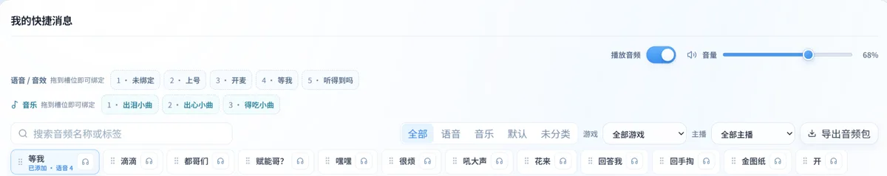

<p align="center"></p>

# 上号 ShangHao

一款给固定朋友长期挂语音、开黑和聊天用的 Windows 桌面语音房。进房后能看到谁在玩游戏、听歌、接电话或暂时离开；声音、聊天和这一晚的记录都留在同一个房间里。

[下载 Windows 最新版](https://github.com/soberbw-hash/shanghao/releases/latest) · [查看 v3.2.1 发布说明](./docs/release-notes/v3.2.1.md) · [所有 Releases](https://github.com/soberbw-hash/shanghao/releases)


<sub>本机隔离环境里的二号房演示画面，成员为模拟数据。它展示界面，不代表三台真实设备已经完成语音验收。</sub>

## 为什么做上号

我们自己和朋友挂语音时，最常碰到的是这些小事：有人半小时没出声，不知道还在不在；几个人麦克风音量差很多；发条微信语音得来回切窗口；昨晚聊到的那个梗，第二天谁也找不到。上号就在这些地方多做了几步。

## 打开房间，就知道大家现在在干嘛

房间最多坐五个人。成员入座、说话、离开和返回会反映在人物与场景里；支持的游戏会出现在电脑位置，音乐状态可以显示当前歌曲。电话模式、屏幕分享等状态也有自己的界面反馈。有人半天没说话，先看一眼房间，比先喊一句“你还在吗”省事。


**人离开了，房间也会知道。** 连续 30 分钟没有操作电脑时，上号会把自己切到离开位置并静音麦克风。重新操作电脑后会回到原来的座位，按当时的扬声器状态决定是否恢复麦克风。手动离开不会被这套自动返回逻辑擅自覆盖。

时间、天气和日历也在房间里。窗外会随天气和昼夜变化，日历可以点开看；它们是房间的一部分，不需要另摆一排工具卡片。


## 先把语音本身做好

五个人的麦克风条件常常完全不同：键盘声、回声、底噪、忽大忽小。上号的麦克风面板有 DeepFilterNet3 降噪、回声消除、人声增强和自动增益，也能做三秒麦克风体检。输入、输出设备分别选；每位朋友的接收音量也能单独调。

可选的好友响度匹配会平滑调整接收音量，减少整晚追着系统音量条调的次数。不同房间、网络和耳机上的听感仍需真实设备判断。


<details>
<summary>音频和连接怎么工作</summary>

桌面端使用 WebRTC/Opus，成员之间优先直连，必要时走 TURN 等恢复路径。五人全互联涉及 10 条成员间连接和 20 条定向媒体路径；仓库有自动化回归，但自动化不等于五副耳机的实机听感。好友响度匹配以约 −16 LUFS 为平滑目标，个人音量控制仍然有效。媒体路径的说明见[运行时图](./docs/assets/architecture-runtime-flow.svg)和[恢复链路图](./docs/assets/architecture-media-recovery.svg)。

</details>

## 电脑没麦，也可以用手机

打开“使用手机麦克风”，扫码后在手机浏览器里授权麦克风，不用装另一款 App。Android 还提供 USB 路径，需要连接数据线、开启 USB 调试并授权这台电脑。扫码连接的实际网络路径由 WebRTC 选择，连接后可以查看延迟、质量和连接方式。

这项能力依赖可用的 HTTPS 手机配对服务。不同手机浏览器、USB 设备和公网网络还需要逐一实机验收。

## 房间里要有点好玩的

“我的快捷消息”把五个语音／音效槽位和三个音乐槽位放在同一页。可以从下方音频库拖入替换、试听、调音量，也能设置快捷键；音频支持搜索和筛选。它更适合固定朋友之间的口头禅和老梗。公开仓库里的音频素材仍需按各自许可使用，不能把所有素材都当成可自由再分发的内容。



喊半天没人回，还能点一下**敲一敲**。对方会收到显眼的本地提醒。想拉朋友进来，房间里的**邀请**入口会复制加入链接，发给朋友即可少走几步找房间的流程。

## 聊天里做了几件每天会用的小事

链接会变成可点击卡片，在系统浏览器打开；图片有预览。聊天消息、图片和链接能用鼠标拖进房间收藏；右键可以直接复制。消息发送有确认、重试和去重处理，两间房的聊天各自隔离。

## 一起看东西，直接共享屏幕

房间里可以选屏幕或窗口给朋友看，也可以选择分享系统音频。一起看网页、让朋友帮忙看操作、分享游戏时，语音仍留在原来的房间。屏幕分享和房间语音是独立管理的媒体轨道。

## 发条微信语音，不该切四次窗口

电话模式会临时处理电脑音频设备和上号麦克风，结束后恢复。快捷键可选“按住生效”或“按一次切换”。需要给别的 App 录一段音时，不必先找回上号窗口、关麦、关扬声器，再重复一遍打开流程。部分独占音频设备可能绕过软件静音，设置页会提示这一点。

## 聊完以后，还能找到昨晚发生了什么

房间可自动录音，结束后保存到本机录音库。回放时可以找精彩时刻 Marker、收藏录音、查看转录文字。长录音转完后还能整理内容，省得第二天为了找一句话重听几个小时。

本地转录模型按高精度和高速度分组，可以独立安装；不同模型的说话人和时间信息能力不同。整理与问答会受模型、配置和录音质量影响，结果需要自己核对。房间问答若使用云端服务，要留意所连接服务器的配置与数据边界。


<details>
<summary>当前转录模型</summary>

模型列表包含 Qwen3-ASR 1.7B / 0.6B、Fun-ASR-Nano、GLM-ASR-Nano、FireRedASR2-AED、Paraformer 和 ARK-ASR 3B Q8_0 等路线；部分模型共用时间对齐组件。具体可安装状态、所需空间和运行条件以应用内“AI 功能”为准。

</details>

房间记录按天保存谁来过、活跃多久、玩过什么、发了多少消息和屏幕分享情况。录音整理出的摘要只有在用户明确发布后才会进入共享的每日记录。

## 与普通语音房的关注点有什么不同

| 日常场景           | 语音房里常见的处理方式 | 上号的处理                             |
| ------------------ | ---------------------- | -------------------------------------- |
| 想知道朋友在做什么 | 看在线状态，或开口问   | 游戏、音乐、电话、离开状态进入房间场景 |
| 人离开电脑         | 麦克风可能继续开着     | 长时间无操作后自动离开并静音           |
| 声音大小不一       | 手动调每个人           | 可选的响度匹配，仍可单独调音量         |
| 临时没有麦克风     | 找另一台设备           | 手机浏览器扫码；Android 可尝试 USB     |
| 想叫挂机的朋友     | 继续喊                 | 敲一敲发本地提醒                       |
| 临时接电话或发语音 | 手动切换麦克风和输出   | 电话模式快捷键处理，结束后恢复         |
| 想找昨晚的一句话   | 依赖大家记忆           | 本机录音、Marker、转录与每日房间记录   |

这些功能适合固定的几位朋友长期使用。上号目前没有公开社区、百人频道或复杂的公会权限体系。

## 下载与开始使用

当前仓库版本为 **3.2.1**，正式支持 **Windows 10 / 11 x64**。[下载 v3.2.1 安装包](https://github.com/soberbw-hash/shanghao/releases/download/v3.2.1/ShangHao-3.2.1-Setup-x64.exe)，或从 [Releases 最新页](https://github.com/soberbw-hash/shanghao/releases/latest)选择版本；同页提供 SHA-256 校验文件。账号支持 CloudBase 手机号验证注册；安装后登录账号，进入一号房或二号房，邀请朋友加入同一服务。[v3.2.1 更新公告](./docs/release-notes/v3.2.1.md)列出本次变更。

服务器负责成员、信令、聊天和必要的共享状态；录音、模型等资料主要保存在本机。自己部署时请看 [Relay 部署](./docs/deploy-relay-server.md)、[TURN 部署](./docs/deploy-turn.md) 和 [网络修复](./docs/network-repair.md)。

**当前验收边界：** 自动化回归不能替代从旧版安装客户端走完“发现更新 → 下载 → 用户点击安装重启”的实机流程。手机麦克风的对端实际听感、不同网络的五人语音也仍需双端设备实测。

## 开发与构建

桌面端采用 Electron、React、TypeScript、Vite 和 Zustand；信令由 Node.js/ws 承担，实时媒体使用 WebRTC，Windows 原生能力由 Rust Core 提供一部分。仓库的 [AGENTS.md](./AGENTS.md) 写明本地开发和数据安全边界。

```powershell
corepack pnpm install
corepack pnpm dev
corepack pnpm typecheck
corepack pnpm --dir apps/desktop test:smoke
```

完整结构见 [3.0 架构总览](./docs/SHANGHAO_3.0_MASTER.md)。改动语音、录音或屏幕分享前，请先看现有回归与[本地多人验收说明](./docs/local-multiplayer-acceptance.md)。

## 开源与反馈

代码采用 [GNU AGPL-3.0-or-later](./LICENSE.md)。项目名称、图标、角色和第三方音频或模型资源各有自己的使用边界，请查阅仓库内的许可说明。遇到问题可以在 [Issues](https://github.com/soberbw-hash/shanghao/issues) 留下版本、复现步骤和经过脱敏的诊断包。
