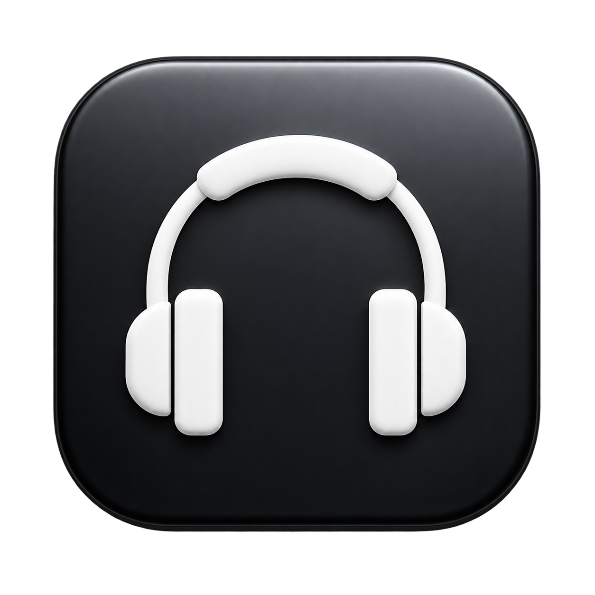
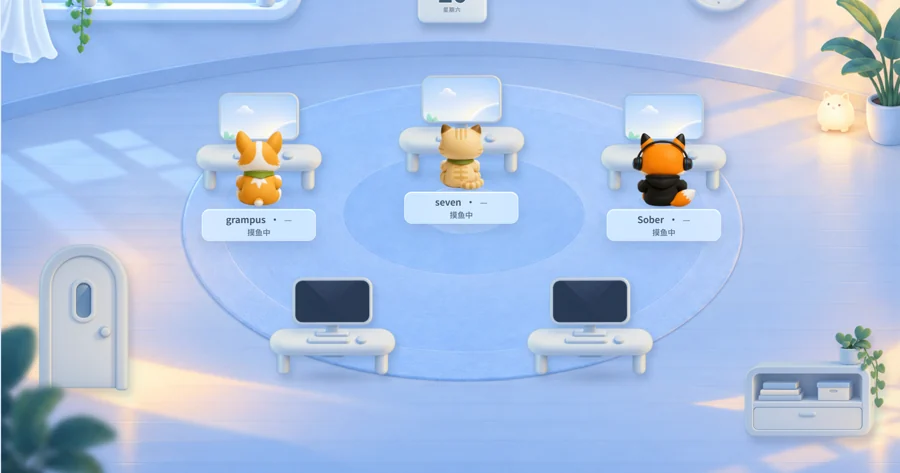
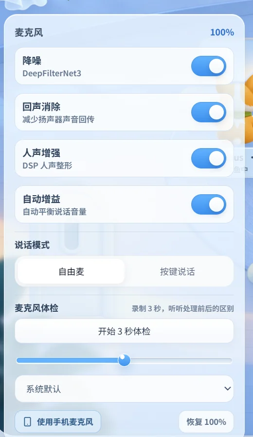
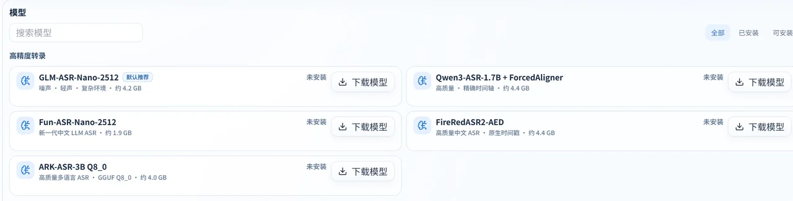
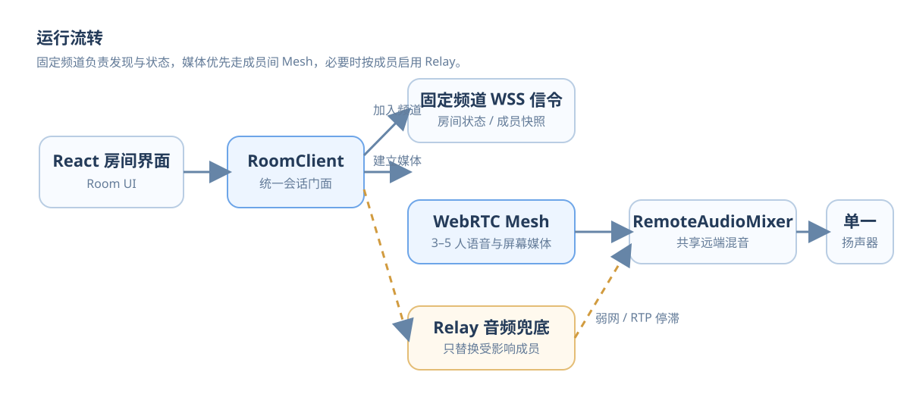
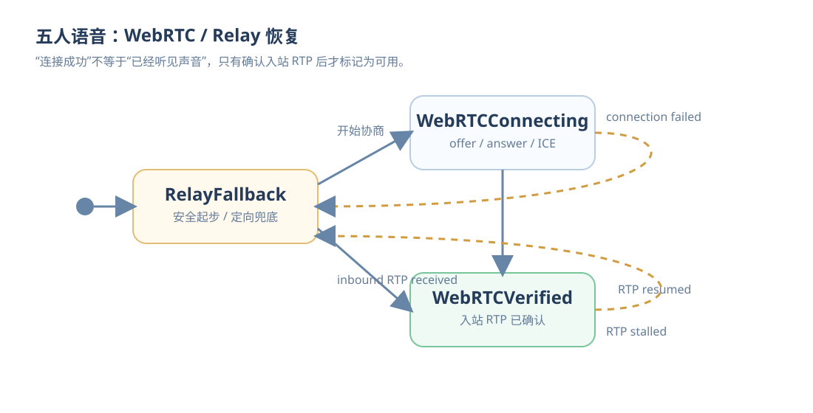
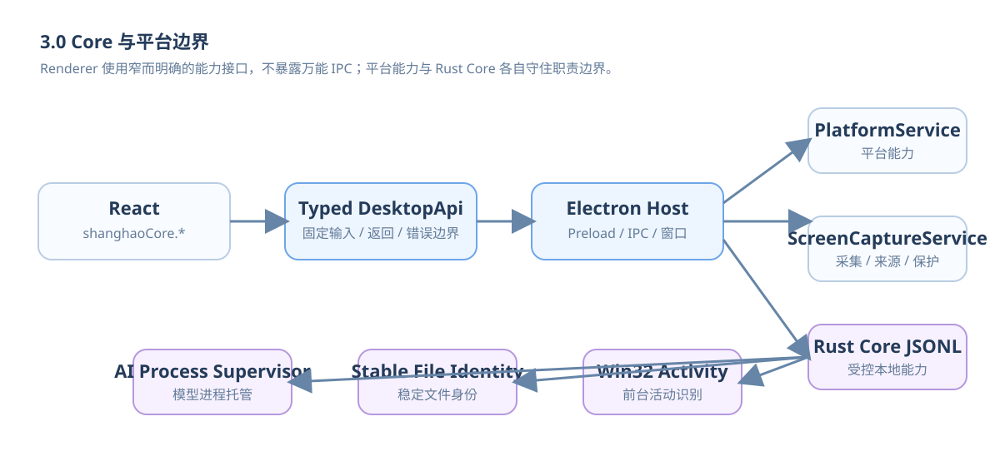

<p align="center">
  
</p>

# 上号 ShangHao

**给固定朋友长期挂语音、开黑和聊天的 Windows 桌面语音房。**

进房先看见人。谁在打游戏、听歌、接电话，谁暂时离开；聊天、分享的画面和昨晚的录音，也都在这间房里。

[下载最新版](https://github.com/soberbw-hash/shanghao/releases/latest) · [看更新记录](./docs/release-notes/v3.3.0.md) · [看技术结构](#声音到底经过了什么)


<sub>二号房演示截图，成员为本机隔离环境中的模拟数据。</sub>

## 如果一群朋友整晚都挂在语音里

总有这些小事：一个人突然没声音，不知道是走开了还是麦坏了；有人声音太轻，有人开口就炸；想找昨天说过的话，却只记得大概时间。上号把这些事做进房间，让人、声音和记录各有位置。

下面按实际使用顺序介绍。每一项都有对应的实现；音质和网络效果仍取决于设备、环境与连接条件。

### 先看见朋友

**01 · 人坐在房间里。** 成员进房、入座、离开、回来，人物和工位跟着变化。最多五人，保留独立的一号房和二号房。谁还在、谁占了哪个座位，打开房间就能看。



**02 · 游戏和音乐不用问。** 支持的游戏会显示在工位；检测到音乐时，房间可以显示正在播放的歌曲。电话模式和屏幕分享也有自己的状态反馈。状态来自当前电脑和房间，不是靠别人手动改签名。

**03 · 人走开，麦也该安静。** 连续 30 分钟没有操作会自动进入离开状态并静音麦克风。回来时返回原座位，是否恢复麦克风取决于当时的扬声器状态；手动离开不会被自动返回覆盖。

**04 · 窗外有时间。** 天气、昼夜、时钟和日历就在房间里。云、夜间光雾与窗边植物有独立的轻动效；页面隐藏或系统要求减少动态效果时，视觉动画会暂停，语音和录音继续运行。


### 把一整晚的声音听舒服

**05 · 五人语音，各走各的链路。** 房间采用 WebRTC/Opus。五人全互联时是 10 条成员间连接、20 条定向媒体路径；直连不通可走 TURN，必要时按成员回退到 Relay。某一路出问题，恢复先针对那位朋友。

**06 · 麦克风先处理噪声。** 可以启用 DeepFilterNet3 降噪、回声消除、自动增益、低切和均衡器。DeepFilter 的模型与 WASM 在本机加载，音频通过 AudioWorklet 处理；不需要把麦克风声音发给云端做降噪。

**07 · 两个人同时开口，保住自己的话。** 音频处理会参考本机麦克风和远端播放音量，区分近端说话、远端回声与双讲。近端有人声时降低 DeepFilter 抑制强度，并平滑混入少量原声，减少字头被吞和人声发闷。具体机制见[下文](#声音到底经过了什么)。

**08 · 人声增强可以单独开。** 本地 DSP 做轻度压缩、齿音控制与音色整理，后面还有输出限幅。它主要照顾忽大忽小和尖锐齿音，不承诺把低质量麦克风变成录音棚设备。

**09 · 每位朋友有自己的音量。** 远端各路独立调节。可选的响度匹配只从说话片段学习音量差，以约 −16 LUFS 的近似目标缓慢修正，增减限制在 ±6 dB，并给峰值留余量；不会在一句话的停顿处把底噪猛地抬高。

**10 · 输入、输出分开选。** 可以指定麦克风与扬声器，查看设备状态，还能做三秒麦克风体检。体检看得见本机是否收到声音；朋友能否听见，仍需对端确认。



**11 · 电脑没麦，手机能顶上。** 用手机浏览器扫码授权，手机声音会作为电脑的麦克风输入继续进入房间链路。网络配对走 HTTPS/WSS 与 WebRTC；Android 还支持数据线连接。手机端有波形和电脑端有输入，只证明前两段通了，最终仍以朋友实际听到为准。

### 聊天、分享和一起玩

**12 · 快捷消息放在聊天旁。** “我的快捷消息”把语音／音效与音乐槽位放在同一页。音频库可试听、搜索、筛选、拖拽绑定；播放开关、音量和快捷键也在这里。主界面的快捷项按内容宽度排布，短的可以多放几个。

**13 · 聊天要能送到。** 消息有 ACK、重试和去重；两间房的聊天各自隔离。链接会变成可点击卡片，能取得网页图片时显示缩略图，打不开预览也不影响打开原链接。图片支持预览；消息、图片和链接可拖入房间收藏。

**14 · 喊不到人就敲一敲。** 对方会收到本地提醒，房间里也有相应的动效。邀请入口可复制加入链接，少走几步找人。

**15 · 想给朋友看，就选屏幕或窗口。** 屏幕分享可选择来源，也可选择是否带上系统音频。屏幕源由桌面主进程统一管理，分享 Track 由专门的管理器持有。

**16 · 接电话时不用手忙脚乱。** 电话模式可用快捷键临时处理电脑音频与上号麦克风，结束后恢复。部分独占设备可能绕过软件静音，界面会提示这一边界。

### 留下值得回看的部分

**17 · 房间录音留在本机。** 可按设置自动录音。回放、精彩时刻 Marker、收藏和转录放在同一条记录上；不会因为退出房间就把本地录音变成公共内容。

**18 · 转录模型按需要安装。** 模型列表提供高精度与高速路线，包括 GLM-ASR-Nano、Qwen3-ASR、Fun-ASR-Nano、FireRedASR2-AED、Paraformer 和 ARK-ASR。GLM-ASR-Nano 有默认推荐标记；已选模型不会被推荐标记改掉。模型体积、时间对齐能力和运行条件以应用内显示为准。



**19 · 长录音可以继续整理。** 转录后可以整理要点、查找片段；房间问答可查询游戏攻略和资料。AI 结果需要自己核对，连接云端问答时也应留意服务器的数据边界。

**20 · 房间记录按天回看。** 成员、活跃时长、游戏、消息数与屏幕分享情况会形成每日记录。整理出的摘要只有用户明确发布后才进入共享记录。

## 声音到底经过了什么

这部分给想知道“它为什么能降噪、怎么知道谁在说话”的人。这里写的是实际链路，不是音质跑分。

```text
麦克风 / 手机麦克风
  → 桌面麦克风的 Chromium 采集约束（AEC、AGC 按设置请求）
  → 低切 → DeepFilterNet3 → 语音保护与原声平滑混合
  → 可选人声增强 → 均衡器 → 发送音量与限幅
  → WebRTC/Opus → 朋友

朋友的 WebRTC/Relay 音频
  → 每人独立接收与音量 → 可选响度匹配 → 扬声器
  → 音量参考回送给本机语音保护，用于判断远端播放与回声
```

### 降噪与回声：两套职责

桌面麦克风采集时向 Chromium 请求回声消除与自动增益，并关闭采集端的噪声抑制，避免和 DeepFilter 重复处理；设备及浏览器可能不完全遵守请求，应用会读取实际 Track 设置作诊断。手机浏览器也会请求关闭自带处理，实际设置依手机而定。DeepFilterNet3 是本地降噪层，WASM 模型由 Electron 提供给 AudioWorklet。模型尚未就绪或运行失败时，链路可退回原声，避免“降噪坏了就整个人没声”。

保护 Worklet 按音频时钟分析低切后的原始麦克风：RMS、随环境缓慢更新的噪声底、过零率和声音连续性组成近端语音线索。同时取远端播放音量，比较短时间内它与麦克风音量变化的相关性，用来判断疑似回声。状态分成噪声、远端回声、近端说话和双讲；切换有短暂确认与保持时间，避免每个字之间反复跳。近端说话时 DeepFilter 抑制级别从 34 降到 24，并混入约 12% 原声；双讲时约 16%。这些是处理参数，**不是降噪分贝数**。混合按采样平滑过渡，不会硬切。

人声增强走另一条轻量 DSP：压缩音量起伏、控制高频齿音、做小幅音色补偿；均衡器和最后的限幅分别负责用户偏好与防止输出过载。设置里能开关这些处理，实际清晰度仍要用自己的麦克风和扬声器试听。

### “谁在说话”怎么判断

每位成员的客户端先分析自己的发送流，再把“正在说话”的状态同步给房间；这不是声纹识别，也不会辨认说话内容。分析器约每 33 ms 取一次频谱能量，缓慢学习持续的风扇声或虚拟设备底噪；开始与结束使用不同阈值，并在声音落下后保留约 180 ms，避免头像闪个不停。接收端另外对每位远端成员做独立的时域 RMS/峰值采样，用于音量显示和响度匹配。接收到 Track 还不等于听到声音，播放链路会用实际音频能量确认后再切换到 WebRTC 路径。

响度匹配只在语音门限以上学习每个人的偏差；约 3.5 秒的能量窗口避免单个音节带偏结果，调节速率有限，句间保留已学到的增益。用户手动设置的个人音量始终独立存在。它是实时听感辅助，不能替代专业的离线 LUFS 测量。

### 手机麦克风怎么接入

**浏览器方式：** 电脑拿到一次性配对信息，手机扫码并授权麦克风；独立配对服务协助 WebRTC 协商，ICE/TURN 用于跨网络连接。电脑收到手机音频 Track 后，将它作为本机输入，继续走上面的处理、房间发送与录音路径。配对页需要可用的 HTTPS，实际连接质量受手机浏览器和网络影响。

**Android USB：** 电脑只为选中的已授权设备建立 ADB reverse 映射。手机浏览器经数据线访问本机临时页面，AudioWorklet 以 48 kHz 单声道采集；带序号的音频帧通过仅监听本机的 WebSocket 转发。电脑端 Worker 统计丢帧，播放 Worklet 用小队列重建 MediaStream，再交给同一条麦克风处理链。断开后不继续把空流当作在线麦克风；缺少设备、调试授权或 ADB 时，界面会直接说明原因。iPhone 使用浏览器配对方式。

## 五人房间下面的结构



成员和协商消息走 WSS 信令；音频优先走 WebRTC Mesh。每位远端成员有独立的 Offer/Answer、ICE 缓存与媒体状态。后加入的人建立自己的连接，某一路停滞时只针对这一路恢复；直连失败再按情况使用 TURN 或定向 Relay。下图是状态处理路径，20 条定向路径是五人拓扑规模，并非任何网络下的听感保证。



React/Zustand 管房间界面与状态，Electron 主进程管窗口、设备和屏幕源；预加载层暴露显式、类型化的桌面能力。Rust Core 负责适合原生层的 Windows 活动查询、稳定文件身份与 AI 子进程监督。WebRTC、DeepFilter、VAD 和模型算法保留在现有媒体与模型链路中。



| 目录                             | 做什么                                       |
| -------------------------------- | -------------------------------------------- |
| `apps/desktop`                   | Electron、React 房间、设备、音频处理与设置   |
| `packages/signaling`             | WebSocket 信令、房间状态与手机麦克风配对服务 |
| `packages/webrtc`                | Peer 生命周期、音频采集与说话检测            |
| `packages/recording`             | 录音状态、编码与导出                         |
| `packages/shared`、`packages/ui` | 共享契约和 UI 基础组件                       |
| `native`                         | 聚焦 Windows 能力与受控后台任务的 Rust Core  |

技术栈：Electron、React、TypeScript、Vite、Zustand、Node.js/ws、WebRTC、Rust。更细的边界见[架构文档](./docs/architecture.md)、[房间运行时](./docs/architecture/room-runtime.md)和[动效规范](./docs/motion-guidelines.md)。

## 下载与使用

当前仓库版本为 **3.3.0**，正式支持 **Windows 10 / 11 x64**。[到 GitHub Releases 下载最新版](https://github.com/soberbw-hash/shanghao/releases/latest)，同页提供安装包、自动更新元数据与 SHA-256 校验文件。[查看 v3.3.0 更新公告](./docs/release-notes/v3.3.0.md)。安装后可通过 CloudBase 手机号验证注册并登录账号，进入一号房或二号房，再邀请朋友加入同一服务。

录音、模型和已下载资源主要保存在本机。更新可在后台下载，安装并重启必须由用户点击。自行部署可参照 [Relay](./docs/deploy-relay-server.md)、[TURN](./docs/deploy-turn.md) 与[网络修复](./docs/network-repair.md)。

**验收边界：** 自动化回归覆盖五人路径，不能代替五副耳机在真实网络中的听感。已安装旧版客户端走完“发现更新 → 下载完成 → 点击安装并重启”，以及朋友在另一台设备上实际听见手机麦克风，仍需分别实测。

## 想自己运行代码

```powershell
corepack pnpm install
corepack pnpm dev
corepack pnpm typecheck
corepack pnpm --dir apps/desktop test:smoke
```

Windows 是正式支持平台；macOS 保留能力降级边界。开发规则见 [AGENTS.md](./AGENTS.md)。代码采用 [GNU AGPL-3.0-or-later](./LICENSE.md)；第三方音频、模型、角色与品牌资源各有使用边界，不能一概视为可自由再分发。问题和脱敏后的诊断可提交到 [Issues](https://github.com/soberbw-hash/shanghao/issues)。
