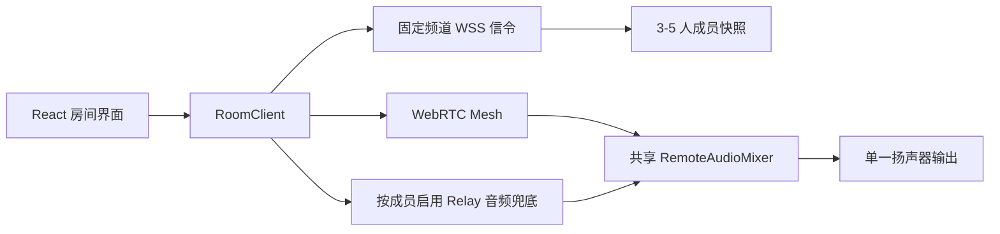
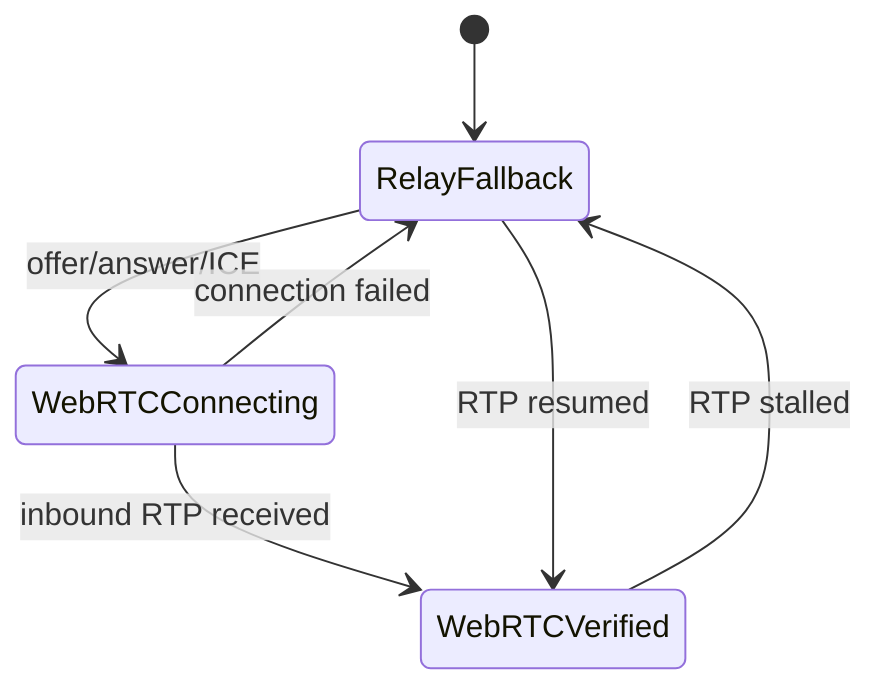
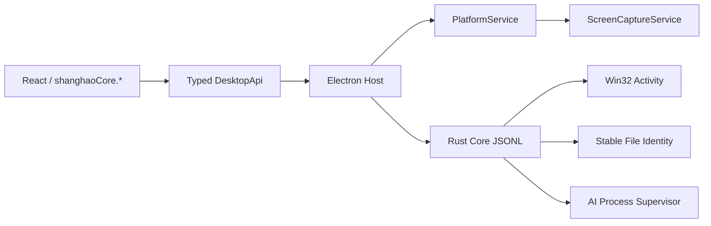

# 上号架构说明

上号是一款仅正式支持 Windows 的桌面端私人语音工具，目标是给 3 到 5 位固定好友提供一个稳定、低打扰、低成本的开黑语音空间。

## 核心原则

- Electron 负责原生能力：托盘、文件系统、日志、全局快捷键、系统通知、录音导出。
- React 渲染层负责 UI、房间状态、WebRTC 编排、设备切换、录音控制。
- 所有客户端只连接固定频道服务器；桌面端不再承担房主服务器职责。
- WebRTC 负责 3–5 人语音和屏幕媒体，采用小房间 mesh；媒体直传失败时，信令服务只为受影响成员提供低带宽定向兜底。
- 录音必须手动开启，最终导出目标是 AAC 编码的 `.m4a`。

## 包边界

- `apps/desktop`
  - Electron 主进程、preload、React 渲染层
- `packages/shared`
  - 枚举、领域类型、常量、IPC 契约
- `packages/signaling`
  - 房间管理和 WebSocket 信令服务
- `packages/webrtc`
  - 音频约束、Peer 生命周期、说话检测、重连辅助
- `packages/recording`
  - 录音状态机、MIME 能力检测、编码器和导出抽象
- `packages/ui`
  - 设计 token 和基础 UI 组件

## 运行流转

1. 用户打开上号。
2. 渲染层读取设置、设备和固定频道服务器状态。
3. 客户端加入固定频道 `main`，服务器确认协议与频道快照。
4. 好友通过 signaling 交换 WebRTC offer / answer / ICE。
5. 多个成员之间建立语音与屏幕媒体 mesh；晚加入者的信令按顺序处理，提前到达的 ICE 会先缓存。
6. 房间页负责成员状态、静音、PTT、设备切换和录音 UI。
7. 录音停止后，主进程接管保存、转码和导出。




## 五人语音路径

每一位远端成员都拥有独立的协商队列和媒体路径状态。Offer、Answer、ICE、
重启与恢复操作按成员串行，避免第四、第五位成员加入时互相覆盖。

WebRTC 连接建立并不等于已经能听见声音。只有统计中确认收到该成员的入站 RTP
包后，才将该成员从 Relay 兜底切换到 WebRTC。若 RTP 停滞，则只让这一位成员
回退到 Relay，不影响另外三到四条正常媒体路径。




## 屏幕分享边界

`ScreenShareManager` 是分享端唯一的 Track 所有者，负责采集、发布、停止、
内容保护和独立窗口同步。房间页面只消费 Manager 状态，不再直接持有采集 Track。
独立观看窗口使用专用最小 Preload，只暴露观看信令和关闭窗口能力，不拥有设置、
文件、更新、诊断或主窗口控制权限。

主进程的源枚举、源选择、内容保护与平台能力集中在 `ScreenCaptureService`。Windows
继续使用已验证的 Electron `desktopCapturer` 与系统音频 loopback，不为了原生纯度
重写采集链；Renderer 的 `ScreenShareManager` 仍是媒体 Track 的唯一所有者。

## 3.0 Core 与平台边界

Renderer 通过显式的 `shanghaoCore.*` 能力逐步访问桌面能力。每个命令有固定输入、
返回值和错误边界，支持超时与取消；Preload 不暴露万能 channel invoke。




Rust Workspace 当前只有一个有实际职责的 `shanghao-core` crate，承担 Windows 前台
活动查询、稳定文件身份和受控子进程生命周期。它不复制 WebRTC、DeepFilter、VAD、
VibeVoice 或 Qwen 算法。Electron Host 继续负责 Chromium、窗口、WebRTC Host、托盘、
更新、Deep Link 和 OS 集成。

`PlatformService` 明确区分 Windows、macOS 和不支持平台。Windows 是当前正式支持并
实测的平台；macOS 只建立能力边界，ScreenCaptureKit、系统音频、签名和公证在没有
真机前不得标记为已验证。

## 3.0 视觉运行时

- `VisualRuntimeController` 提供共享、可见时才运行的 rAF 和有界资源预加载缓存。
- `DisplayRefreshRateService` 从真实帧间隔估计显示器刷新率，不把目标 FPS 当作实测值。
- `RoomAnimationScheduler` 在同一帧先批量读取再批量写入，按 key 合并更新；队列溢出
  时丢弃最旧增量并触发一次全量校准。
- Weather、Calendar、Clock 和角色环境动画在页面隐藏时暂停；信令、WebRTC、音频、
  录音和模型任务不属于视觉暂停域。
- `styles/index.css` 只保存有序导入，实际样式按基础、场景、角色、聊天录音、动效和
  最终材质等职责拆分。架构测试限制入口与分片继续膨胀。

## 工程守卫与验证

`architecture-guard.test.ts` 对 CSS 入口/分片、RoomClient、RoomPage、SignalingServer、
Core/Platform/视觉模块和 Preload 能力边界设置可执行约束。CI 保留原有 Release 工作流，
增加 Rust 格式/单测；长会话工作流必须手动触发，不会在普通提交上自动消耗两小时。

本地验收默认不打包：

```powershell
powershell -ExecutionPolicy Bypass -File scripts/verify-local-acceptance.ps1
```

只有显式传入 `-Package` 才会生成 Windows 安装包。

## 动效边界

- CSS 负责 Hover、Focus、颜色、边框和轻量图标状态。
- Framer Motion 负责挂载卸载、列表补位、弹窗和局部 Crossfade。
- GSAP 负责页面时间线、场景编排、敲一敲和多角色互动。
- 角色状态机独立负责起身、行走、改道、落座与待机。

同一 DOM 层的 `transform`、`opacity`、`filter` 和 `clip-path` 只允许一个引擎控制。
详细规则见 [动效开发规范](./motion-guidelines.md)。
